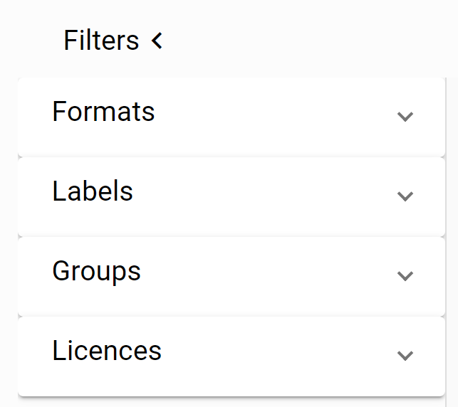

The Portal offers a homepage where you can highlight your goals, showcases and stories. There is a separate page with all the datasets, presented as cards. Through the filter and search options userscan easily navigate to a dataset. The data can also be arranged according to the theme's or organisations/departments.

The datasets are always shown with the metadata, a download option and a contactform. When applicable also a table, map or API is provided.

## Homepage
The homepage of the portal provides an introduction to explain the policies of the customer.

## Search
The search box offers autocompletion. Start typing to get suggestions, based on the title, description or tags.

## Datasets Overview
The dataset overview section allows you to further refine search results.

### Filters
The filter options, on the datasets page, offers several ways to search for particular datasets. Active filters are shown. With the “clear all” option all filters are removed. It´s also possible to clear individual filters.

<table class="table-images">
    <tbody>
        <tr>
            <td>
                
            </td>
        </tr>
    </tbody>
</table>

### Datasets Details
Display different aspects of the selected datasets.

The following display options are availabel:
* Table View
* Map View
* Contact Form

### Themes
Themes are based on required items from the DCAT-standard. Clicking on a theme acts a filter to show the relevant datasets. The number shown at each theme, refers to the number of datasets. 

### Language Selection
....more content to come....