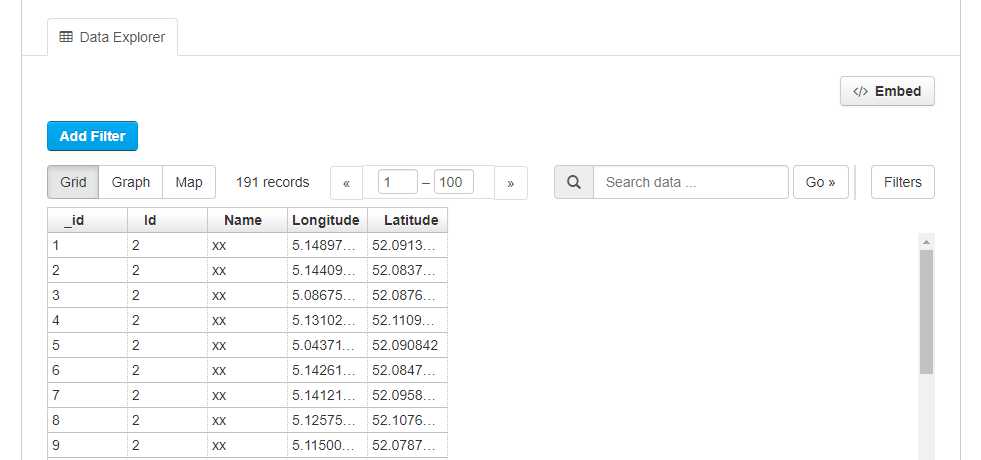

> The CKAN resource page can contain one or more visualizations of the resource data or file contents (a table, a bar chart, a map, etc). These are commonly referred to as resource views.

## Preview in CKAN

Different plugins are included in Dataplatform CKAN to preview different resource file types:

- Data Explorer

  The Data Explorer consists of a **_Grid_**, **_Graph_**, and **_Map view_**

  - Grid view: will display a table for tabular data (CSV/XLS/XLSX)
  - Graph: different options to display a graph for CSV/Excel files
  - Map view: will show a map for CSV, Excel, or GeoJSON files which contain geographical coordinates.

  **_Note:_** This plugin requires data to be in the DataStore

- Text view
  - Is able to display plain text files, JSON, or XML files (can depend on configuration of the plugin)

- Image view
  - Is configured to show PNG, JPEG or GIF files

More information on previewing resources can be found in <a href="https://docs.ckan.org/en/2.8/maintaining/data-viewer.html" target="_blank">CKAN documentation</a>

### FAQ

#### Q: Why is there no view even though a view should be displayed according to the documentation?

**A:** For tabular data (i.e., csv/xls files) the table view is automatically added as these files get uploaded to the Data Store, which is a prerequisite for loading a data explorer view. This should always work if a csv/excel file is uploaded through the normal CKAN user interface. If, however, this is done via an API call, it could be that some parameters are missing (e.g., the file type was not specified), which could end up in the table view not being created. If this is the case, just follow the steps provided below to create a View.

#### Q: How can I add a view?

**A:** You can add a View by going to: **_Manage_**->**_Views_**->**_New View_**-> **_Data Explorer_**.

---

## Preview Portal

On the portal there is a **_Table view_** and **_Map view_**:

#### Table view

On the portal a table preview is automatically added for CSV files. The table will show a maximum of 100 items a page.

#### Map view

Will be shown when **_Geo-Enabled_** is set to yes and coordinates are included.

#### CSV

For CSV resources map will show the first 100 records/items. If you click _Show Table_ below the map view. You are able to go to the next 100 items or go back to the previous ones.

#### GeoJSON

GeoJSON resources will show all records at once on the map. See the example below.

