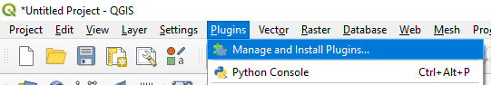
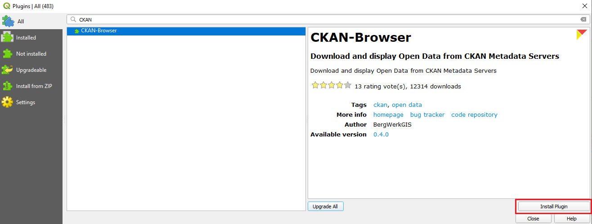
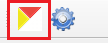
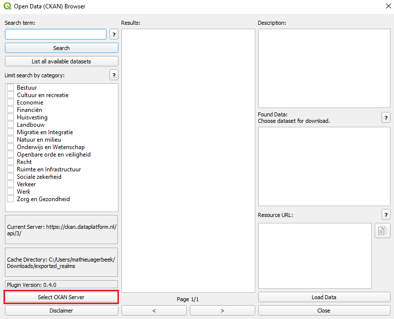
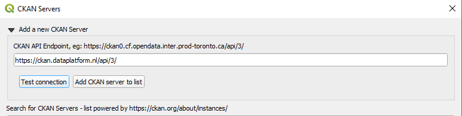
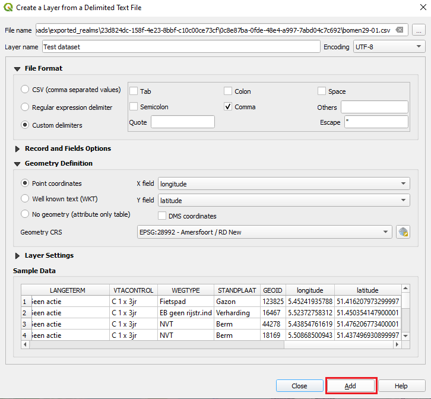
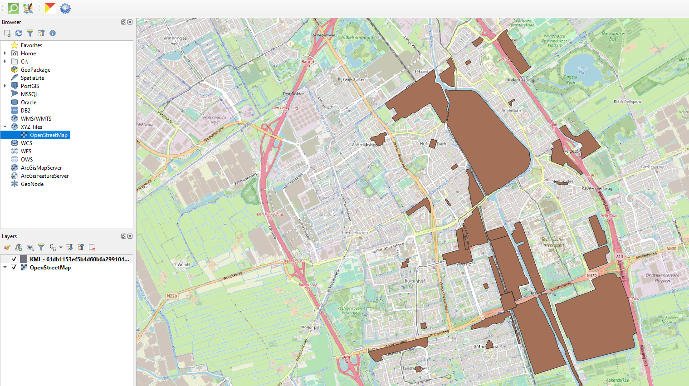

## Creating Maps Using QGIS 
> Open source software QGIS can be used to visualize (geographical) datasets 

To be able to create visualisations in QGIS, you need to install the **CKAN-Browser** plugin in QGIS. This plugin will give you access to all datasets that are in the CKAN [DataStore](datasets_AddingDatasources#datastore). Below we will provide the necessary steps to start using this plugin in QGIS.

### 1. Install plugin

> ***Note***: This tutorial is based on QGIS version 3.8.3. Newer versions might look different from the screenshots below.

The first step is to install the actual plugin. Click on the *Plugins* tab and then go to *Manage and Install Plugins...*

Now search for the CKAN-Browser plugin and click *Install plugin*

### 2. Configuring plugin

After installing the plugin correctly, you will now see two icons in QGIS. Click the left icon as shown in the screenshot below.

To be able to view the Dataplatform datasets, you need to add the desired CKAN server.
This can be configured by clicking on *Select CKAN server*.

You are asked to provide the CKAN API endpoint. For the Dutch CKAN Dataplatform this is **https://ckan.dataplatform.nl/api/3/**.

You should now be able to search for all datasets that are available in the CKAN Datastore.

### 3. Create visualisation

After finding the desired dataset, select the specific datasource you want to visualize and click *Load Data*. 

For CSV files you will be asked to select the correct geometry columns and geometry CRS.  

The created data layer can be combined with a map layer such as the open source OpenStreetmap to display the data on a map.

