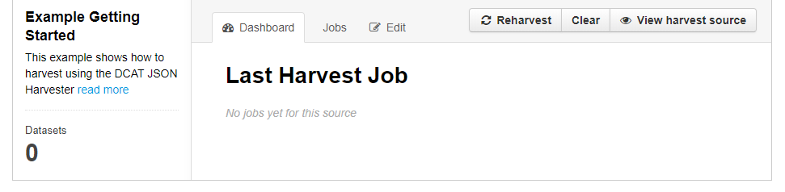

>***Note***: This tutorial assumes background knowledge of what type of sources are compliant with the three harvester options in CKAN

This step-by-step tutorial will show you how to set up one of three types of [harvester options available in CKAN](harvesting_Harvesting#types-of-harvesters). 

We will demonstrate the set up of a harvester using the JSON DCAT Harvester. Setting up this harvester will allow you to harvest data from JSON objects based on DCAT metadata fields into your CKAN instance. 

Some examples of JSON DCAT sources:

* https://raw.githubusercontent.com/ckan/ckanext-dcat/master/examples/dataset.json
* https://geoportaal-ddh.opendata.arcgis.com/data.json
* https://metadata.geodata-utrecht.nl/dcat

## Example: Where to start

To begin setup of a harvester in CKAN, you need to add `/harvest` to the URL of your CKAN instance. 

##### For example: 
```sh
 https://YOUR-CKAN-PORTAL-NAME/harvest
```

On this `/harvest` page, you will see an overview of harvester sources that are currently set up. On this page you can add additional harvesters.

### 1. Adding a Harvester
Click on the *Add Harvest Resource* button


### 2. Configure a Harvesting Source

After clicking the *Add Harvest Resource* button, you need to complete the following fields:

* ##### URL (mandatory)

    The URL contains the actual harvesting source. In our example we will use a JSON file which consists of DCAT metadata for two datasets. Each dataset in our example contains multiple different file types. The example JSON file that is used can be viewed here: [JSON DCAT file](assets/Dataplatform/Harvesting/Example_file.json).
    
    


* ##### Title (mandatory)

    The title that is provided will be used in the URL name of the harvester.
    


* ##### Description

    Provide an appropriate description for your harvester.
    


* ##### Select source type

    In our example the source type is the DCAT JSON Harvester. An explanation of each type of source can be found here: [types of harvester options in CKAN](harvesting_Harvesting#types-of-harvesters).
    


* ##### Update frequency
    > When frequency is set to **always**, the harvester will reharvest as often as possible. In other words, this option lets the harvester run with the smallest time-interval possible.

    Update frequency options are: *always, weekly, biweekly,* or *monthly*.
    


* ##### Custom configuration
    >Custom configuration only accepts JSON objects. You may find an example of additional harvester configuration [here](assets/Dataplatform/Harvesting/Example2.json).

    Custom configuration allows you to provide additional requirements or fields for the harvester to harvest.
    


* ##### Select the appropriate organisation from a dropdown list

    

* ##### Save your configuration 

    Click the blue save button - your harvester setup is now complete.
    


### 3. Running Your Harvester

1. ##### Click the Admin button

    

2. ##### Click the **Reharvest** button to initialize the harvester

    

3. ##### Click the **Confirm** button to begin the harvesting process

    

### 4. The Havesting Process
> Depending on the source, the harvester process will take one to several minutes to finish

On the harvester's Admin page, you will see a tab labeled *Dashboard*. On this tab, you will see information about harvester's current or last completed process.


In our example, you can see that there are no notifications underneath **Last Harvest Job**. If the process has compeleted, you can click on the *Dashboard* tab again to refresh the page. 


Here we can see that the process is finished - In our example the page shows that two datasets were added. 

### 5. View harvested datasets

* Clicking the **View Harvesting Source** button will display datasets that we added during the harvesting process.
    

* The harvested datasets are now displayed
    