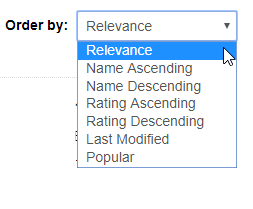

Sorting allows you to reorder datasets in different ways.

## Sorting Datasets
> Public datasets are visible to users without valid login credentials.

Datasets can be sorted in the following ways:

| Name | Explanation |
| :---- | :----------- |
| Relevance | first: score / second: last modified |
| Name Ascending | number followed by A-Z, based on title |
| Name Descending | Z-A followed by number, based on title |
| Rating Ascending | Datasets rated by best sorted on top |
| Rating Descending | Non-rated datasets sorted to top |
| Last modified | most recent modifications to metadata |
| Popular | Highest rating and views on top |
