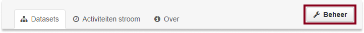
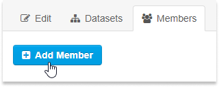
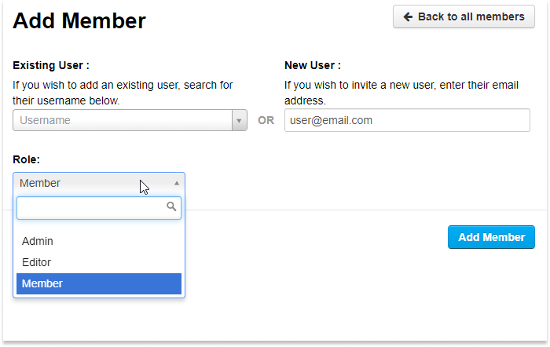

In order to add, edit or delete datasets, you need be logged in. Your login permissions are based configured at the organization-level; you have the possibility to be a member in one or more organizations. This allows you to manage multiple datasets across different organizations. Each organization also contains different user permission levels; roles. 

For more information about user permissions, see [User Roles](#user-roles).

## Login
> Your username is found in your email. It follows the format:  `[user]-[number]`

Login credentials are controlled on an invite only basis; access can be granted to CKAN by your organization's administrator. Once access has been granted, you will be required to confirm your email; confirming your email will generate a password.

The login button is located at the top of the page on the right side. Here you will login with your username and password.

<!--  -->

<!--  -->

### Dashboard
When you are logged in your name will appear at top of the page; you are directed to your dashboard. The dashboard allows you to view the latest datasets that you have previously worked on.

Clicking on “My Organization” will allow you to see the datasets owned by your organization(s). If you possess the correct credentials, you can then add, edit, or delete datasets.

### User Roles
Roles set the permission levels that an organization's users have; different roles grant different privileges. Each organization is currently limited to three roles.

| Role | Permissions  | 
| ----------------------------  | ----------------------------   | 
| Member           |<ul><li>View the organization’s private datasets</li></ul> | 
| Editor           |<ul><li>View the organization’s private datasets</li><li>Add new datasets to the organization</li><li>Edit or delete any of the organization’s datasets</li></ul> | 
|Admin |<ul><li>View the organization’s private datasets</li><li>Add new datasets to the organization</li><li>Edit or delete any of the organization’s datasets</li><li>Add users to the organization, and choose whether to make the new user a member, editor or admin</li><li>Change the role of any user in the organization, including other admin users</li><li>Remove members, editors or other admins from the organization</li><li>Edit the organization itself (for example: change the organization’s title, description or image) </li><li>Delete the organization</li></ul>|

### Editing User Roles
> Only organization administrators may change other user's roles 

From the organization's dataset page, select the "🔧 Manage" button, followed by the "Members" tab.

In this tab, all of the organization's users are displayed. An administror may edit a user's role by clicking on the 🔧 icon next to their name. Administrators may also remove users by clicking the red cross button, located at the end of the name. A pop-up appears asking for confirmation. 

### Creating New Users
> Only organization administrators may create new users

From the organization's dataset page, select the "Manage" button, followed by the "Members" tab. Select the “Add Member” button.

Existing users are users who are alreay members in another organization. New users are users who are not members of any existing organization. To initiate setup of a new user, simply fill in their email address.

> Ensure you set the correct role for the user. For more information on roles, see [User Roles](#user-roles)

When you click “Add Member”, the new member will receive an automated email to the address entered. The username and user number will be generated from this e-mail adress.

The new user's state will stay as "pending," until they confirm their email address.

## User Details 
> Your API key is private, do not share this with anybody!

While you're logged in, clicking on your name will bring you to your User Details page. In this page you will see what datasets you own, in addition to your Activity Stream, and your personal information. By clicking on the title of a dataset, will redirect you to that dataset. 

The personal information displayed, consists of the following: 
* **User information**
* **E-mail** *- this is private - organization administrators cannot see your email* 
* **Member since** 
* **State** *- active or pending* 
* **API Key** *- this is private - organization administrators cannot see your email*

<!--  -->

### Edit User Settings
To adjust your user settings and details, select the ⚙ (settings cog) at the top right corner of the screen. Note: your username cannot be changed.

Here you can change your password, adjust your name (which is displayed when you are logged in), change your email, and reset your API key when it is compromised. You may also write a small bio in the "About" textfield - note: this textfield accepts <a href="https://www.markdownguide.org/basic-syntax" target="_blank" rel="noreferrer noopener">Markdown Formatting.</a>

