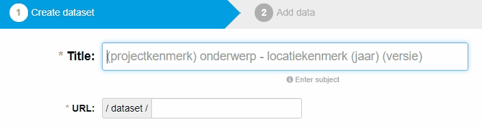
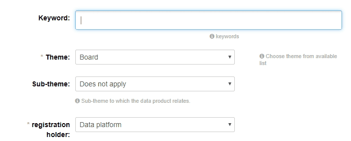

On this page, you will find the two steps required to publish datasets:
1. Adding metadata
2. Adding your datasource

## 1. Adding Metadata
> Metadata is simply data about data

Metadata is data that provides information about other data. Typically this means a description and context about existing data.

By conforming to the DCAT-Standard, datasets may be automatically registered in the National Open Data Register: [Data Overheid Nederland](https://www.data.overheid.nl).

> **What is the DCAT-Standard?**
> 
> DCAT describes datasets in data catalogs. By utilizing the DCAT-Standard, publishers increase discoverability and enable applications to easily consume metadata from multiple catalogs. Furthermore, it enables decentralized publishing of catalogs and facilitates federated dataset search across sites. Aggregated DCAT metadata can serve as a manifest file to facilitate digital preservation.


### Title
A title is a unique identifier – it must be short and specific. For example, “Sporting Events 2016 Utrecht” is much more specific than “Sporting Events.” For best results, specify the location of the dataset inside the title, as this will allow users to better find your dataset on [Dataplatform.](https://www.dataplatform.nl)

A good naming guideline to follow when creating a title:
```sh
root_category - subject - location(year) - version(number)
```

An example using our naming guideline:
```sh
Sport - Sporting Events - Utrecht 2019 - Version 1
```



> *Be mindful:*
>
> The title you choose will be rendered as part of the dataset’s URL. The URL is generated in the following template: [https://www.dataplatform.nl/data/YOUR_TITLE](#blank).  When the title is generated into a URL, capital letters will be converted to small letters and spaces will be replaced by hypens ( - ).


### Description
This field represents an overview of your dataset. Your description should answer the following questions: 

* What is the data about?
* Where does the data come from?
* What is the quality of the data?
* Over what timeframe or period was the data recorded?

You may use [Markdown Formatting](https://www.markdownguide.org/basic-syntax) in the description field. This allows you to utilize headers, lists, **bold**, and *italics.*

Example, the following raw markdown:

```sh
* **Description:** Sporting Events Utrecht
* **Source:** Permits Department
* **Target:** Providing insights into events from the municipality
* **Limitations:** This dataset is not to be used for legal purposes
* **Possibilities:** This dataset may be used for insight into locations on a map
* **Coordinate System:** WGS84
```

Will be rendered as:

* **Description:** Sporting Events Utrecht
* **Source:** Permits Department
* **Target:** Providing insights into events from the municipality
* **Limitations:** This dataset is not to be used for legal purposes
* **Possibilities:** This dataset may be used for insight into locations on a map
* **Coordinate System:** WGS84


### Tags
> It is advisable to enter tags that do not appear in the description or title of your dataset. Dataplatform already indexes keywords in the Title and Description fields.

Tags influence search terms. Utilizing tags will make your datasets easier to find. Entering the first few letters of your intended tag will make Dataplatform search for the closest existing match – if it matches, click on the tag in the dropdown list.
If your intended tag does not match any existing entries, complete the entire word, then hit the *return* key. Once your new tag has been entered, it is now possible to use this as an existing tag.
If you select the wrong tag, you may remove it by click on the cross “X” in front of the word.




### Licenses
> Licenses dictate how your dataset may be used. You can find information about open data licenses here: [Conformant Licenses](http://opendefinition.org/licenses/)

Licenses are selected by clicking on the dropdown box; you must select an option.

The default license for open data is “Creative Commons CC Zero.” This means that the dataset may be used without limitations. The “Creative Commons Attribution” license allows users to freely use your data, but they must reference the source of the data.

> Open Data Register (Data Overheid) only publishes datasets with the following licenses:

| Licenses                                                             |  
| :------------------------------------------------------------------- | 
| [CC-0](https://creativecommons.org/publicdomain/zero/1.0/)           | 
| [CC-BY 3.0](https://creativecommons.org/licenses/by/3.0/)            | 
| [CC-BY 4.0](https://creativecommons.org/licenses/by/4.0/)            | 
| [Public Domain](https://opendatacommons.org/licenses/pddl/summary/)  |


If your require a different license, please contact Dataplatform’s administrator.


### Organization
If you are part of an organization, you may only add and manage datasets and files connected to that organization; this field is completed in automatically.


### Visibility
> Visibility is set to private by default. Choose “public” to make the dataset available as open data on (dataplatform.nl)[https://www.dataplatform.nl]

Dataplatform has two types of visibility options: private and public. Datasets that are marked as “private” are only viewable in [CKAN](https://www.ckan.dataplatform.nl) for users with the correct organizational rights; the dataset is not viewable on [](https://www.dataplatform.nl).

The visibility status of your dataset is indicated by a label in the top-right corner.


### Provider
> This field is available for datasets that may be purchased or assigned

This field provides the source of your data. The source will refer to this location, when the data is made publicly available; initially the data source is *not available.*

This field is not mandatory – if there is no information available, leave it blank.


### Version
> Every dataset may be given a version number.

Incrementing the version number on each subsequent edit will allow users to see whether there have been previous data sets, which are no longer viewable.


### Contact Email
The contact email allows users to send questions or comments to the dataset owner.


### Language
The default language is set to Nederlands, but additional options are available from the drop-down box.


### Category
Categories are pre-defined. You must select the closest match from the list.


### Data Owner
The owner of the dataset, typically this is an organization (province, ministry, municipality, etc).

If you wish to be listed on the Open Data Registry (Data Overheid), the name in Data Owner must match the one given to the government agency on the Open Data Registry. The list of organizations can be found here: [Organizations](https://data.overheid.nl/data/organization).


### Provider Email
This is the organization’s email, which allows users to contact you should they have questions or comments. 

This is usually a general email address, as the source holder’s email has been entered earlier


### Version Comments
You may make revision comments, concerning each version of the dataset. Typical comments would include: what was done, and an overview of what was added/removed.


### Update Frequency
This sets the update frequency of your dataset.


### Update Frequency
This sets the update frequency of your dataset.


### Location
Each dataset is tied to a geographic location and geographic boundary.


## 2. Adding Data Sources

Now that the metadata has been added, we can now add the dataset(s). Click on the “Next: Add Data” button at the bottom of the page.

### Source

You may add data via upload or via URL.

> If a CSV or (geo)JSON are uploaded, these will be accessible by Dataplatform’s API. Other datatypes are saved and provided as a download link.

### Additional Details

Additional information may be added here. The following information deals with the additional fields:

* Name: *This will be the filename, ensure it is descriptive*
* Description: *Provide an explanation of the contents of the file*
* Format: *The format in which the source is provided (CSV, XLS, JSON, PDF, etc).*

If you have additional sources to add, choose "Save & Add Another."
If you only have one, choose "End."

> CKAN will now save the file and create a dataset. The resulting entry is immediately viewable - if the visibility is set to "Public," the dataset will become viewable on [Dataplatform.nl](https://www.dataplatform.nl). "Private" datasets are not visible on Dataplatform.

## Congrats, your dataset is now live! 🎉🎉
