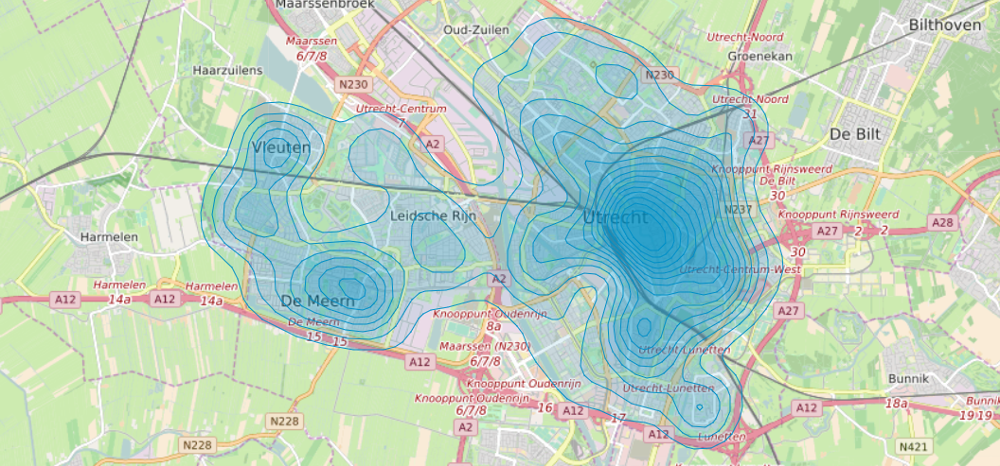
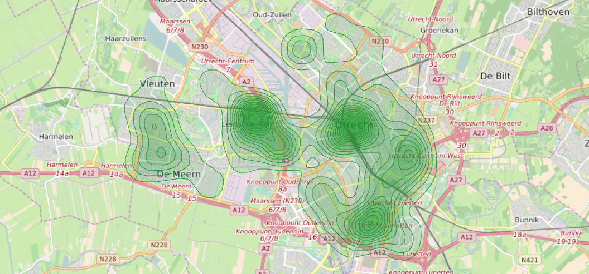
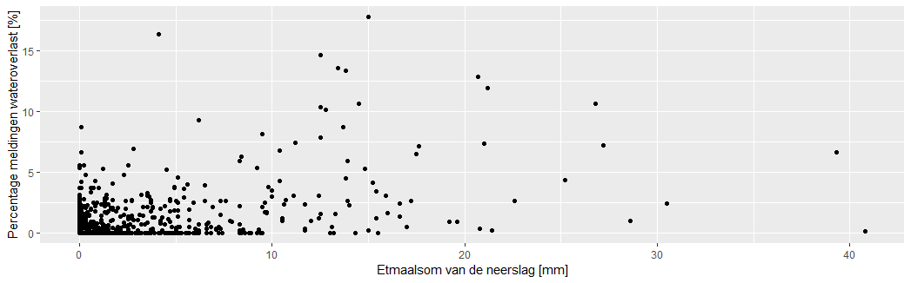

> Dit is een praktisch voorbeeld waarbij alle stappen van deze nieuwe manier van werken worden bezocht. Alle eerder genoemde onderwerpen zullen in meer of mindere mate aan bod komen met de nadruk op 'wateroverlast'

De impact van wateroverlast op de samenleving zal de komende jaren alleen maar toenemen zoals uitgebreid is beschreven in [Wateroverlast](kookboek_wateroverlast.md). Hierin is ook de link gelegd naar de Meldingen Openbare Ruimte (MOR) als een bruikbare databron. In dit document zal hier verder op in worden gegaan en ook een combinatie gemaakt worden met de weersdata van het KNMI. Een uitgebreide kijk in de data van het KNMI is te vinden onder [Voorbeeld dataset - KNMI](kookboek_data_knmi.md)

## Van beleid naar data

De gemeente Utrecht gebruikt een applicatie Slim Melden waarmee zij meldingen van inwoners verzamelen. Eén van de categorieën waarover een melding gedaan kan worden, is wateroverlast.

In de afgelopen 2,5 jaar zijn in totaal meer dan 160.000 meldingen verzameld. Deze meldingen zijn beschikbaar als open data en kunnen dus door iedereen gebruikt worden (en worden gecombineerd met andere data. Hieronder staat een voorbeeld van een dashboard van de gemeente Utrecht, waarbij de categorie wateroverlast is geselecteerd. 

#### Aandachtspunten
* dit is de data van één gemeente en categorieën verschillen per gemeente (hetgeen de vergelijkbaarheid bemoeilijkt)
* het aantal meldingen hoeft niet te corresponderen met de werkelijke overlast (alleen gemotiveerde/gedupeerde inwoners hebben een melding gedaan)
* VNG Realisatie is bezig met een standaard voor Meldingen Openbare Ruimte. Wanneer alle data van elke gemeente in hetzelfde formaat beschikbaar is, ontstaan er meer mogelijkheden om de data met elkaar te vergelijken.

Ondanks alle beperkingen kan deze informatie een eerste beeld opleveren waar zich problemen met wateroverlast voordoen in stedelijk gebied.
Een vervolgstap is om deze data te combineren met weersgegevens (KNMI), zodat een relatie gelegd kan worden met extreme neerslag, de Algemene Hoogtekaart Nederland (AHN) en de BGT (verharding).

Techniek:
* Hoe zorgen we ervoor dat de AHN, BGT en KNMI data permanent beschikbaar zijn (dus periodiek geupdate worden)

In toenemende mate is er sprake van real time data.

## Van data naar informatie

In de context van MOR zal de data bestaan uit een lijst van meldingen met minimaal een locatie, tijdstip en een beschrijving. In het geval van Slim Melden is dit nog eens uitgebreid met categorieen en eventuele foto's en stemmen. Stemmen betekent in dit geval burgers die dezelfde melding ook belangrijk vinden.

Maar belangrijk is natuurlijk een kwalitatief begrip: wat voor de een belangrijk is, geldt niet voor een ander. Daarom is het goed om de totstandkoming van deze dataset te begrijpen. Een sensor stuurt gewoon een meting zonder enig motief; een burger is echter een heel ander verhaal. Hieronder staat een overzicht van de stappen die worden doorlopen om tot een melding te komen:

1. Er *is* een **probleem in de Openbare Ruimte**.
2. De burger *neemt* dit **probleem in de Openbare Ruimte** *waar*.
3. De burger *vind* dit een **probleem voor de burger**.
4. De burger neemt de moeite om dit **probleem voor de burger** te melden.

Er wordt expres een onderscheid gemaakt tussen **probleem in de Openbare Ruimte** (vanuit het oogpunt van de gemeente) en een **probleem voor de burger** (vanuit het oogpunt van de burger). Deze zijn namelijk niet per definitie gelijk, omdat de gemeente een andere agenda heeft dan de burger. Bijvoorbeeld omdat de gemeente met een langere termijn visie werkt, in tegenstelling tot een burger die vooral niet gehinderd wilt worden in zijn of haar dagelijkse gang van zaken.

Het is dus belangrijk om te zien hoe een dataset tot stand is gekomen. Het feit dat er geen meldingen zijn, betekent dus niet dat er geen probleem is. En de mate van burgerparticipatie heeft een belangrijke impact op hoe deze dataset eruit ziet.

## Van informatie naar presentatie

Nu bekend is wat de precieze informatie is (namelijk meldingen van problemen in de openbare ruimte door burgers die dit probleem ook waarnemen en vervelend vinden) kan deze informatie worden omgezet naar kennis. Of in ieder geval gepresenteert worden. Hieronder zijn een aantal voorbeelden uitgewerkt, waar ook de inzichten van de vorige stap aan bod komen. 

### Verdeling meldingen

Een eerste stap om een idee te krijgen van de impact van wateroverlast is bekijken waar deze overlast nou voorkomt. Hieronder is een verdeling weergegeven van de meldingen in Utrecht in de categorie wateroverlast in de periode 9-8-2018 t/m 21-8-2019. Hoe minder transparant de blauwe kleur, des te minder meldingen er in dat gebied zijn gemaakt. Duidelijk is met name de Binnenstad en in mindere mate Vleuten, De Meern en Lunetten plekken zijn waar veel meldingen gemaakt worden. Hoe meer mensen ergens wonen, des te groter de kans dat er iemand is die alle 4 de stappen doorloopt om tot een melding te komen. Dus is deze verdeling zo wel representatief?

### Verdeling stemmen

Hieronder staat een soortgelijke verdeling, maar nu in plaats van meldingen het aantal stemmen. Dit zijn dus meldingen waarvan andere burgers vinden dat ze dit ook een probleem vinden. Wat opvalt is dat dit tot een ander beeld leidt; nog steeds staat de Binnenstad bovenaan, maar Leidsche Rijn is nu ook opeens duidelijk aanwezig. 

### Meldingen en het weer

Een andere aanpak is het vergelijken van de melden met weersgegevens, bijvoorbeeld de hoeveelheid regen op een dag versus het percentage meldingen over wateroverlast op die dag. In dit geval is het percentage een betere meetwaarde, om zo schommelingen per dag eruit te halen. Een dag met 100 meldingen in totaal waarvan 20 over wateroverlast telt dus in dat geval net zo zwaar als een dag met 25000 meldingen waarvan 5000 over wateroverlast. 

Elk punt in de grafiek stelt hieronder stelt een dag voor met op de x-as het aantal mm regen dat die dag is gevallen en op de y-as het percentage meldingen over wateroverlast. In de periode 9-8-2018 t/m 21-8-2019 ligt het percentage dus tussen de 0% en de 18% en de etmaalsom tossen de 0 mm en de 42 mm.

Wat opvalt is dat er geen duidelijke lijn te zien is tusen de meldingen en de neerslag. Het gros van de punten ligt linksonderin (geen regen, geen meldingen) en tussen de 10 en 15 mm regen lijkt het percentage meldingen toe te nemen, maar dit zet niet door. Sterker nog, voor alle dagen met meer dan 30 mm regen komt het percentage niet boven die met 0 mm regen. Maar wellicht is dit de verkeerde vergelijking: 30 mm op een dag kan betekenen dat het de hele dag zachtjes heeft geregend heeft (1 mm per uur) of dat er een korte maar heftige wolkbreuk is geweest (bv. 60 mm in een half uur). 

- Juiste maatstaf: wat is een goede voorspeller voor wateroverlast? Is dat toch de etmaalsom, of is het toch beter om de maximale regenval per uur te gebruiken. En hoe vergelijk je die met meldingen? Als het de avond ervoor zwaar geregend heeft, moeten de meldingen van de dag erop dan meegenomen worden met de dag ervoor? Maar in welke mate dan?
- Gebrek aan metingen: het aantal dagen met een hoge etmaalsom zijn schaarser, waardoor het lastig is om het gedrag van de burgers in te schatten vanuit de beschikbare gegevens.
- Verwachting van de burger: hoe ervaart een burger een bui? Het zou kunnen zijn dat een burger bij een heftige bui wateroverlast als vanzelfsprekend beschouwt en het dan dus niet als een probleem ervaart, terwijl een relatief kleinere bui die wateroverlast veroorzaakt meer opvalt en dus eerder zal worden gemeld.
- Geen waarnemingen: mensen blijven misschien binnen met slecht weer en nemen daardoor minder waar.

Vanuit een statistisch oogpunt kan worden gezegd dat er een redelijke correlatie is tussen de regenval en het percentage, maar dat regenval alleen niet genoeg verklaard om een voorspelling te kunnen geven. Dat betekent dat er andere (belangrijkere) maatstaffen zullen gevonden moeten worden om daadwerkelijk iets te kunnen zeggen.