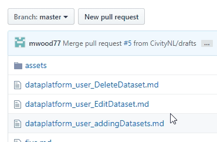

This is where you describe what it is that you’ll accomplish on this page. 

For information about changing the page Title (*"Template & Formatting"* on this page), see: <a href="https://docusaurus.io/docs/en/doc-markdown#documents" target="_blank">Markdown Headers - Documents</a>

## Prerequisites
```Text formated like this``` and
  
   
    like this 
 
represents the input as typed; type what you see, in-order to generate the desired markdown feature (ie. headings, bold, lists, etc)

## Main Heading
```## Main Heading```

This will be the anchor heading for the page, or perhaps the first step in a series of processes. Directly underneath, you may add further information explaining what this heading/task is.

### Subcategory Headings
```### Subcategory Headings```

This will be a subcategory heading of the “Main Category Heading.” These may breakdown features, sub-tasks, etc.

#### Additional Formatting (Sub-subcategory listing, no listed in in-page navigation)
```#### Additional Formatting (Sub-subcategory listing, unlisted in in-page navigation) ```

* list item
``` * list item```

* **bold** ```**bold**```
* *italic* ```*italic*```
* `inline code` ``` `inline code` ```
* codeblock
    ```javascript
   ```sh (shell) <- accepts many different languages
   codeblock
   you must indent 3 spaces on each line```
    ```
* table:
    | COLUMN_HEADER 1 | COLUMN_HEADER 2  |
    | ----------------------------  | -----------------------   |
    | some information           | some information             |
    | more information           | more information             |

    ```javascript
    | COLUMN_HEADER 1 | COLUMN_HEADER 2  |
    | ----------------------------  | -----------------------   |
    | some information           | some information             |
    | more information           | more information             |

    perfect alignment of each column " | " is not necessary
    ```


* callout:
    > this is an important message

    ```> this is an important message```
* unordered list:
    * shoes
    * tennis elbow
    * elephants

    ```javascript
    * unordered list:
        * shoes
        * tennis elbow
        * elephants
    
    indent is required when using sub-items
    ```


* ordered lists:
    1. shoes
    2. tennis elbow
    3. elephants

    ```javascript
    * ordered lists:
        1. shoes
        2. tennis elbow
        3. elephants

    indent is required when using sub-items
    ```


### Links and Image Styline
```### Links and Image Styling ```


* list item
``` * list item```

* [this is an ***internal*** link to nowhere](#) 
    ```javascript
    [this is a link to nowhere](#)
    ```
* <a href="">This is an ***external*** link to nowhere</a> 
    ```javascript
    <a href="">This is an ***external*** link to nowhere</a>
    ```
* <a href="" target="_blank">This is an ***external*** link to nowhere that opens in a new tab</a> 
    ```
    <a href="" target="_blank">This is an ***external*** link to nowhere that opens in a new tab</a>
    ```
*  ``` ```
    

    * GIfs and images must be inserted in the following (HTML) format with a class assignment of "**imageStyle**" to use uniform styling constraints.
    
        * GIFs require an additional class assignment of "**shadowing**"

    ```javascript
    
    ```

    * class imageStyle applies:
    ```javascript
    .imageStyle {
        margin: 20px 0;
        padding: 10px;
    }
    ```

    * class shadowing applies:
    ```javascript
    .shadowing {
        box-shadow: 0px 4px 5px 1px rgba(0, 0, 0, .25); 
    }
    ```

    * Background shadows are applied in our image editor(s). Shadow dimmensions are as follows:
    ```javascript
    Drop Shadow
             Blur:    25(px)
             X:       10(px)
             Y:       10(px)
             Color:   000000
             Opacity: 15%
    ```

### Subcategory Heading 2
``` ### Subcategory Heading 2```

This will be a subcategory heading of the “Main Category Heading.” These may breakdown features, sub-tasks, etc.

## Closing Heading
``` ## Closing Header ```

this summarizes what was completed/done by following this page. This can be a standalone header, or a header with text.
