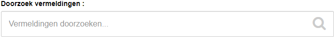
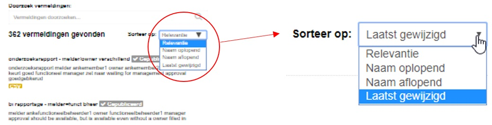

Om vermeldingen te bekijken is het niet nodig om ingelogd te zijn. CKAN gebruikers kunnen inloggen met hun gebruikersaccount. Inloggen is nodig voor alle bewerkingen van de vermeldingen. Iedereen die de DataCatalogus benadert binnen de gemeente (vanaf een IPadres wat op de whitelist staat) kan de vermeldingen bekijken.

In een vermelding staan (afhankelijk van het dataproduct) gegevens vermeld. Deze gegevens zijn metadata.

Metadata zijn vastgelegd in verschillende standaarden:

- DCAT – voor alle datasets
- INSPIRE – voor geodata
- Klantspecifiek - Eigen metadataschema voor de DataCatalogus

Voor elke vermelding zijn de volgende metadata minimaal ingevuld:

- Titel
- Beschrijving
- Organisatie
- Trefwoorden / tags
- Thema
- Type Dataproduct
- Eigenaar

Op basis van de ingevulde gegevens kan de bron herleid worden. Met de eigenaar kan contact opgenomen worden, indien de originele niet vrij toegankelijk is.
Brongegevens hoeven niet per definitie in de DataCatalogus te worden toegevoegd. In de DataCatalogus zijn bronnen niet de basis, maar de duiding van de bron: waar kun je het vinden, waarvoor kun je het gebruiken, wie heeft het dataproduct verzameld.

## Zoeken

Door gebruik te maken van de zoekbalk kunt u zoeken op:

- (deel van de) Titel
- (deel van de) Omschrijving
- Tags (ook wel :abels of Trefwoorden genoemd)

Zoeken kan alléén op een heel woord en is hoofdletteronafhankelijk. De vermeldingen (die aan de zoekopdracht voldoen) van alle diensten staan in de lijst onder elkaar. Deze lijst kan op verschillende manieren worden gesorteerd.

## Filteren

Aan de linker kant van de pagina kunt u de datasets filteren op basis van:

- Gepubliceerd
- Makers
- Organisaties
- Thema’s
- Subthema’s
- Tags
