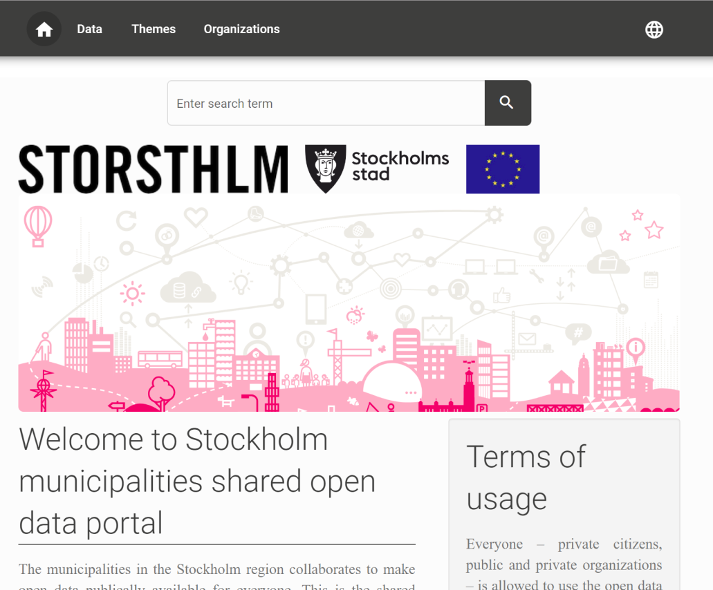
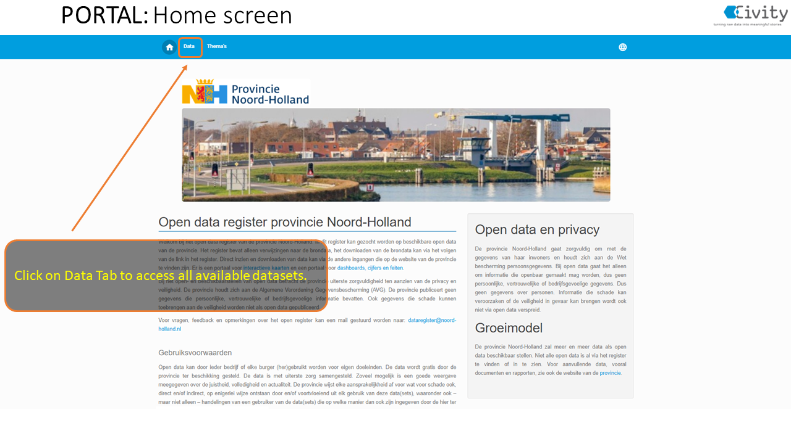
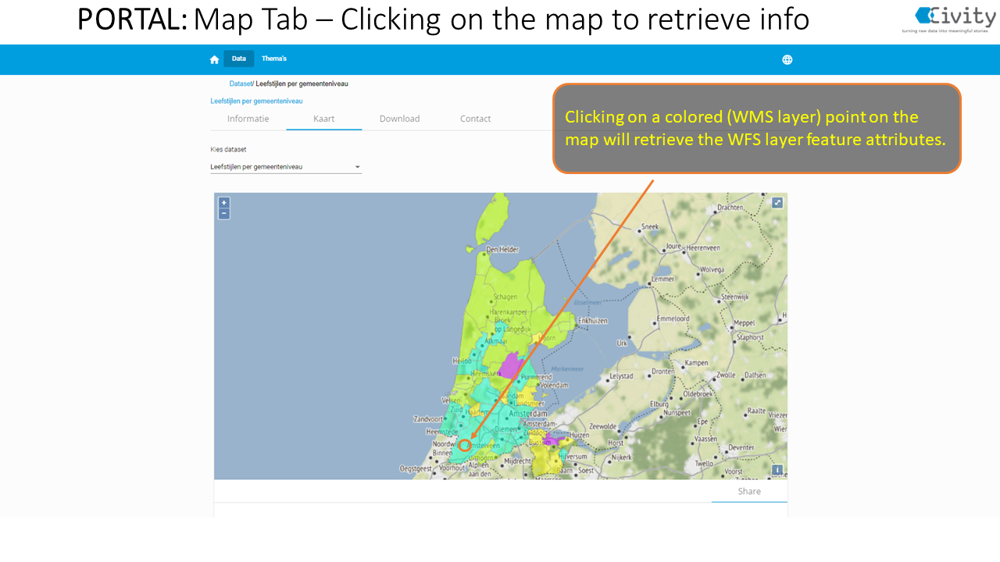
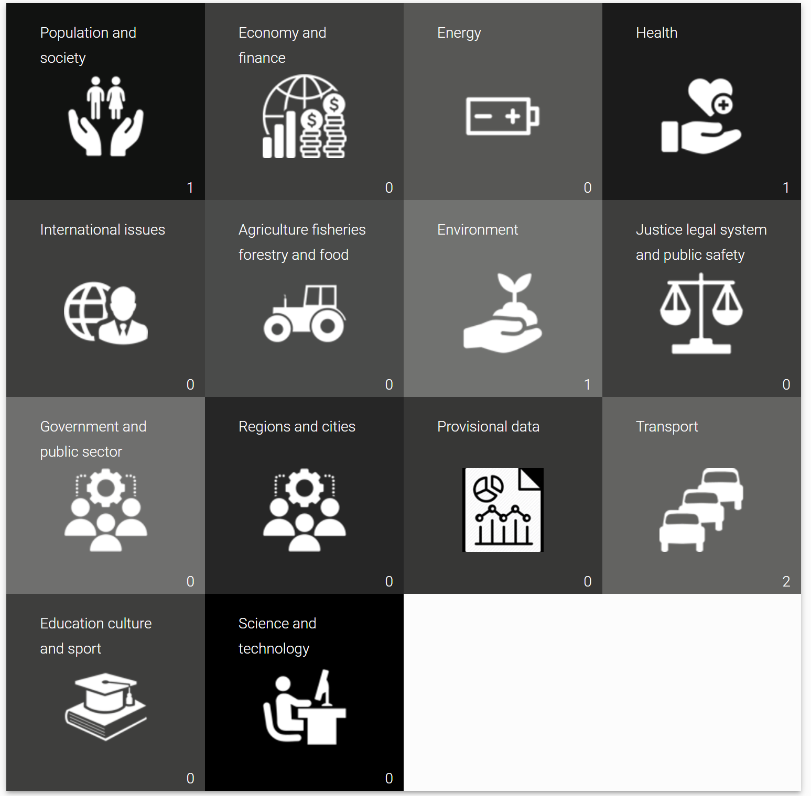

The Open Data Portal offers an environment where you can highlight your goals, showcases and stories. There is a separate page where all datasets are displayed. The filter and search options allow users to easily navigate to a dataset. The datasets can also be arranged according to the themes or organizations/departments.

The datasets are always shown with the metadata, a download option. In addition, there is the option to add a contact form tab. When applicable also a table, map or API is provided.

## Homepage

The homepage of the open data portal contains an introductory description of what can be found on the portal. In addition, this page often contains more information about which organizations publish data on the portal and general terms and conditions may be described. In addition, contact details of the managing organization can be found.

## Search

The search box offers autocompletion. Start typing to get suggestions, based on the title, description or tags.

## Datasets Overview

When you click on 'Data' you will get an overview of all available datasets. Each dataset contains an overview of the available display options. On the overview page you can further refine the search results by using the 'Filters' menu.

### Filters

:::info Attention!

Specific filter options may vary by portal.

:::

The filter options, on the datasets page, offers several ways to search for particular datasets. Active filters are shown. With the “clear all” option all filters are removed. It´s also possible to clear individual filters by clicking the 'X' button.

<table class="table-imageStyles">
    <tbody>
        <tr>
            <td>
                
            </td>
        </tr>
    </tbody>
</table>

### Datasets tabs

The following tabs are available when you select a specific dataset:

1. Information: Contains the description, tags, metadata, and statistics for the dataset.
2. Table: shows a preview of a selected resource within the dataset.
3. Map: Shows a preview of the data from resources on the map.
4. Download: download available resource files.
5. Contact form: asking questions at dataset level.

Below you will find a more detailed description of the different tabs:

### 1. Information

When you click on information, the following categories of information are available:

- Description
- Tags
- Metadata
- Statistics

**Description**: Here you will find a description of the dataset in general and possibly also about the resources that are part of the dataset. How broad this description is will vary per dataset.

**Tags**: Tags, also known as labels or keywords, are a way of classifying a dataset. Similar datasets can be found via tags. When you click on a tag, you will be taken to an overview page of datasets where this tag has also been used.

**Metadata**: When you click on metadata, you will see an overview of all metadata fields that belong to the dataset. Most of the metadata fields come from the DCAT standard. This allows open datasets to be automatically displayed in the national data registers and the EU portal. In addition, a number of specific metadata fields are available for geographical datasets to be able to transfer the data to Geonetwork (e.g., Dutch Nationaal Georegister).

**Statistics**: Here you will find the last updated date, the number of page visits and the rating of the dataset.

:::caution Attention!

A page visit is counted when a dataset is viewed via the CKAN url. Viewing the data via the portal is therefore not automatically counted as a page visit.

:::

### 2. Table

The table functionality is available for resources that are stored in the DataStore. The table will show a preview of the data per resource. By pressing the 'eye' icon, a pop-up will give you an at-a-glance overview of the column names and values for a specific row.

#### Download Datastore Table

Below the table you will find the option to download the datastore table. With the DataStore table download you can download the DataStore table, as shown in the preview, per resource.

:::caution Attention!

The DataStore table download may differ from the download via the 'Download' tab. The 'Download' tab always contains the original data file. When the data file is transferred to the DataStore, it is possible that extra columns have been added to the data file, for example to improve the table or map display.

:::

#### Data dictionary

The Data dictionary can be used to more explicitly describe the contents of a dataset using labels and descriptions. For example, sometimes the column names that appear in a resource are not very clear to an end user. Click [here](./dataplatform_DATASETS_DataDictionary.md) for more information about the Data dictionary.

#### Metadata

Here you will find the metadata associated with the selected _resource_.

### 3. Map

You can find a preview of geographic data via the 'Map' tab. The available functionality is further explained in the screenshots below:

#### Welcome page:

#### Data tab:

#### Map tab:

#### Time series data

### 4. Download

Here you can download the original resources in the available formats. In addition, under the heading API, you can find an explanation of how you can search the data via the DataStore API.

#### Downloading data

There are several ways to download a dataset.

1. If you click on the 'Data' tab, you will see all available datasets. They are each represented in a so-called _card_. On the right side of the card you will see a 'download' button. Clicking on it will take you to the page with all downloadable files and an overview of endpoints. By clicking on the cloud behind the file, you can download the file.

2. If you clicked on a dataset to find out if it is the correct dataset, you can go to the download tab. There you will find all files to download.

### 5. Contact Form

Some portals have a contact form with a dataset. Here you will find a form where you can leave questions about the dataset. These questions are sent to the organization responsible for the open data portal.

## Themes

Themes are based on required items from the DCAT-standard. Clicking on a theme acts a filter to show the relevant datasets. The number shown at each theme, refers to the number of datasets.

## Language selection

You can switch languages by clicking on the globe at the top right. You can also find the current version of the open data portal there.

:::note Attention!

The welcome page texts and texts belonging to a specific dataset will not be adapted to the selected language.

:::
