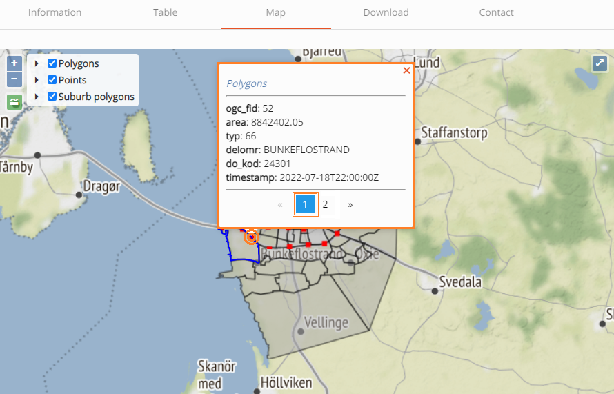
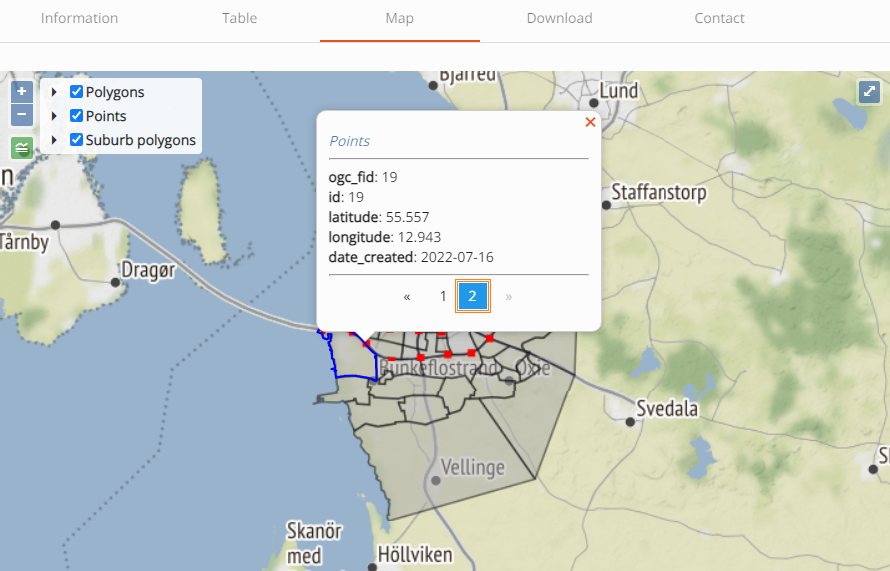
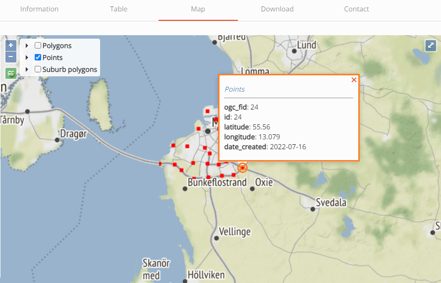
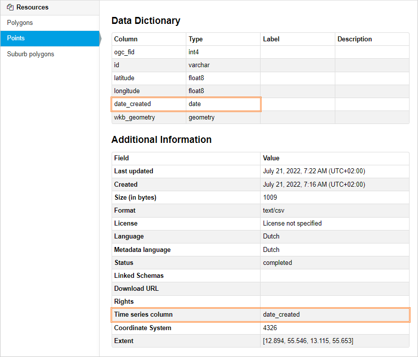
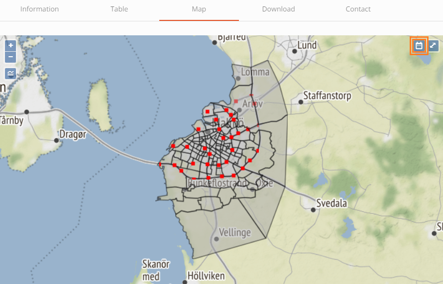
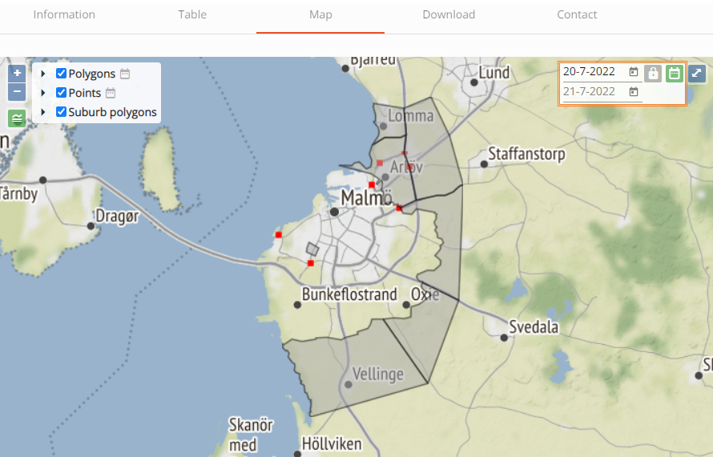
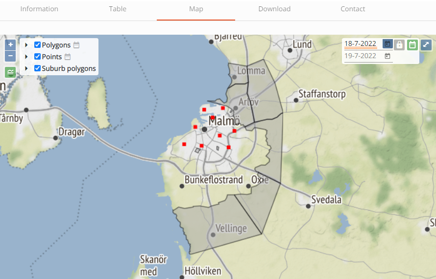
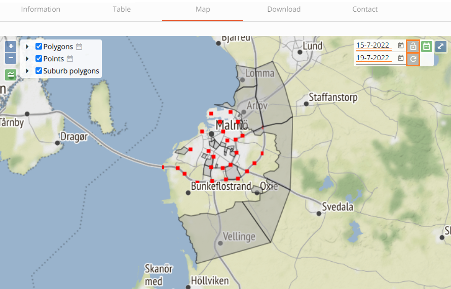
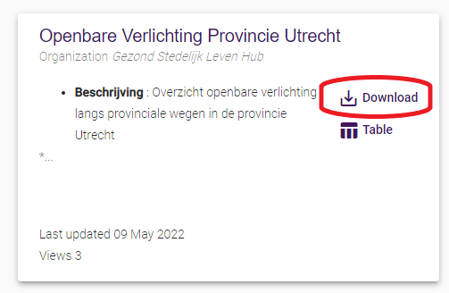

The Open Data Portal offers an environment where you can highlight your goals, showcases and stories. There is a separate page where all datasets are displayed. The filter and search options allow users to easily navigate to a dataset. The datasets can also be arranged according to the themes or organizations/departments.

The datasets are always shown with the metadata, a download option. In addition, there is the option to add a contact form tab. When applicable also a table, map or API is provided.

## Homepage

The homepage of the open data portal contains an introductory description of what can be found on the portal. In addition, this page often contains more information about which organizations publish data on the portal and general terms and conditions may be described. In addition, contact details of the managing organization can be found.

## Search

The search box offers autocompletion. Start typing to get suggestions, based on the title, description or tags.

## Datasets Overview

When you click on 'Data' you will get an overview of all available datasets. Each dataset contains an overview of the available display options. On the overview page you can further refine the search results by using the 'Filters' menu.

### Filters

:::info Attention!

Specific filter options may vary by portal.

:::

The filter options, on the datasets page, offers several ways to search for particular datasets. Active filters are shown. With the “clear all” option all filters are removed. It´s also possible to clear individual filters by clicking the 'X' button.

<table class="table-imageStyles">
    <tbody>
        <tr>
            <td>
                
            </td>
        </tr>
    </tbody>
</table>

### Datasets tabs

The following tabs are available when you select a specific dataset:

1. Information: Contains the description, tags, metadata, and statistics for the dataset.
2. Table: shows a preview of a selected resource within the dataset.
3. Map: Shows a preview of the data from resources on the map.
4. Download: download available resource files.
5. Contact form: asking questions at dataset level.

Below you will find a more detailed description of the different tabs:

### 1. Information

When you click on information, the following categories of information are available:

- Description
- Tags
- Metadata
- Statistics

**Description**: Here you will find a description of the dataset in general and possibly also about the resources that are part of the dataset. How broad this description is will vary per dataset.

**Tags**: Tags, also known as labels or keywords, are a way of classifying a dataset. Similar datasets can be found via tags. When you click on a tag, you will be taken to an overview page of datasets where this tag has also been used.

**Metadata**: When you click on metadata, you will see an overview of all metadata fields that belong to the dataset. Most of the metadata fields come from the DCAT standard. This allows open datasets to be automatically displayed in the national data registers and the EU portal. In addition, a number of specific metadata fields are available for geographical datasets to be able to transfer the data to Geonetwork (e.g., Dutch Nationaal Georegister).

**Statistics**: Here you will find the last updated date, the number of page visits and the rating of the dataset.

:::caution Attention!

A page visit is counted when a dataset is viewed via the CKAN url. Viewing the data via the portal is therefore not automatically counted as a page visit.

:::

### 2. Table

The table functionality is available for resources that are stored in the DataStore. The table will show a preview of the data per resource. By pressing the 'eye' icon, a pop-up will give you an at-a-glance overview of the column names and values for a specific row.

#### Download Datastore Table

Below the table you will find the option to download the datastore table. With the DataStore table download you can download the DataStore table, as shown in the preview, per resource.

:::caution Attention!

The DataStore table download may differ from the download via the 'Download' tab. The 'Download' tab always contains the original data file. When the data file is transferred to the DataStore, it is possible that extra columns have been added to the data file, for example to improve the table or map display.

:::

#### Data dictionary

The Data dictionary can be used to more explicitly describe the contents of a dataset using labels and descriptions. For example, sometimes the column names that appear in a resource are not very clear to an end user. Click [here](./dataplatform_DATASETS_DataDictionary.md) for more information about the Data dictionary.

#### Metadata

Here you will find the metadata associated with the selected _resource_.

### 3. Map

You can find a preview of geographic data via the 'Map' tab. The available functionality is further explained in the screenshots below:

#### Welcome page:

#### Data tab:

#### Map tab:

#### Time series data

##### Multilayer Map: Generic functions

1. On multi-layer implementation, when accessing the Map Tab, the user no longer gets a dropdown button to select to display one resource at a time, but instead, all layers are simultaneously loaded and displayed.

2. On the top left part of the map, a new legend button is added under the zoom controls. Clicking this button, user reveals a list of available geo-data layers. By default all layers are visible when accessing the Map tab.

3. When clicking on the map, a popup is displayed, returning information for the selected features. If there are overlapping layers, popup is populated with more than one tabs, each on representing its corresponding layer.

4. At any time, user can choose which layers to display. By clicking on the checkbox next to the layer’s name (inside the legend box), user can enable or disable a layer.

5. This way, user can return information only for the layer of his choice, in case of overlapping layers.

6. User can also make use of the fullscreen functionality, displaying the map and it’s layers in a higher resolution. Clicking the Fullscreen button on the top right of the map will expand the map on a fullscreen mode.

##### Multilayer Map: Date picker function

1. When at least one of the layers has a timestamp field set, a TimeSeries button reveals on the top right of the map, next to the fullscreen button.

2. Timestamp field is set as a resource metadata field in CKAN side, labeled ‘Time series column’ where the user defines the column under which dates are stored and will be used to filter results based on these.

3. When clicking on the legend button on the top-left to reveal the list of available layers, the ones that contain a timestamp field, can be spotted by a similar date-icon next to their name.

The user can enable the Date Picker filter by clicking on the Date Picker button. A date menu will appear with date select options.

This will automatically filter data based on the default date interval (1 day). The default date when enabling Date Picker is set to today’s date.

Non-timestamp layers will always display all their available data, whatever the date range set. If user is confused by the amount of data displayed, he can simply hide the unneeded layers by unselecting them from the legend layer list.

If the user wants to set a different interval, he has two options:

1. Select a different start date and the end date will be automatically adjusted based on the default interval (1 day)

2. Unlock the interval, select both a start date and an end date and then click on the refresh button that got revealed.

The user can still hide a layer while the Date Picker filter is enabled.

Locking the interval back to 1 day, will keep the start date intact and set the end date automatically to match the interval rule.

The user can disable the Date Picker filter by clicking again the corresponding button. The date menu will disappear.

This will disable the filter and refresh the map to display the full data of the timestamp layers. Non-timestamp layers will remain as is.

### 4. Download

Here you can download the original resources in the available formats. In addition, under the heading API, you can find an explanation of how you can search the data via the DataStore API.

#### Downloading data

There are several ways to download a dataset.

1. If you click on the 'Data' tab, you will see all available datasets. They are each represented in a so-called _card_. On the right side of the card you will see a 'download' button. Clicking on it will take you to the page with all downloadable files and an overview of endpoints. By clicking on the cloud behind the file, you can download the file.

2. If you clicked on a dataset to find out if it is the correct dataset, you can go to the download tab. There you will find all files to download.

### 5. Contact Form

Some portals have a contact form with a dataset. Here you will find a form where you can leave questions about the dataset. These questions are sent to the organization responsible for the open data portal.

## Themes

Themes are based on required items from the DCAT-standard. Clicking on a theme acts a filter to show the relevant datasets. The number shown at each theme, refers to the number of datasets.

## Language selection

You can switch languages by clicking on the globe at the top right. You can also find the current version of the open data portal there.

:::note Attention!

The welcome page texts and texts belonging to a specific dataset will not be adapted to the selected language.

:::
