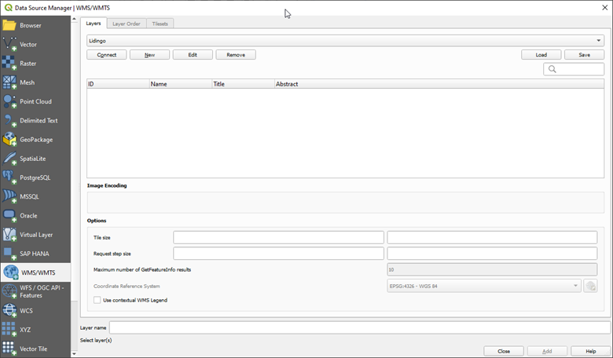
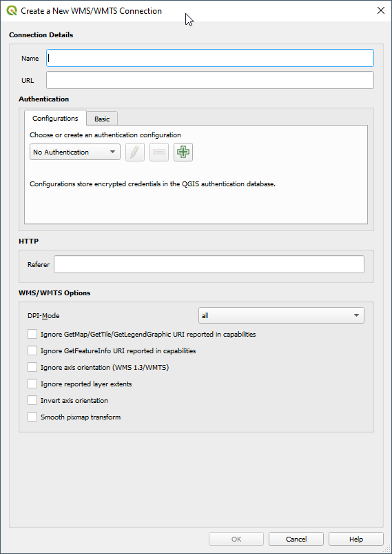
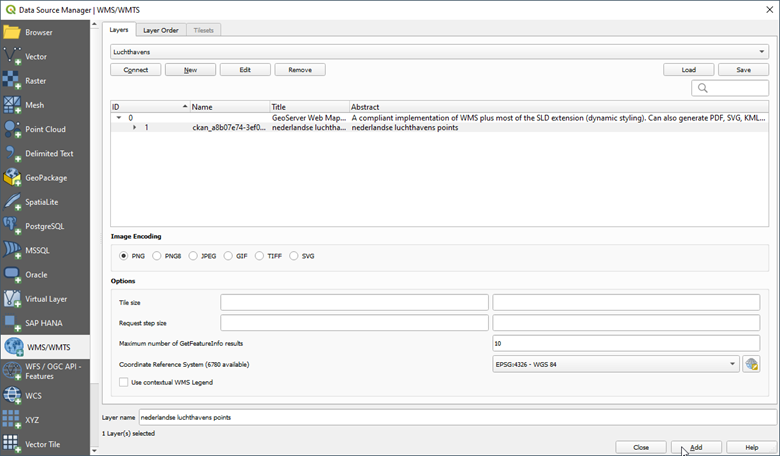
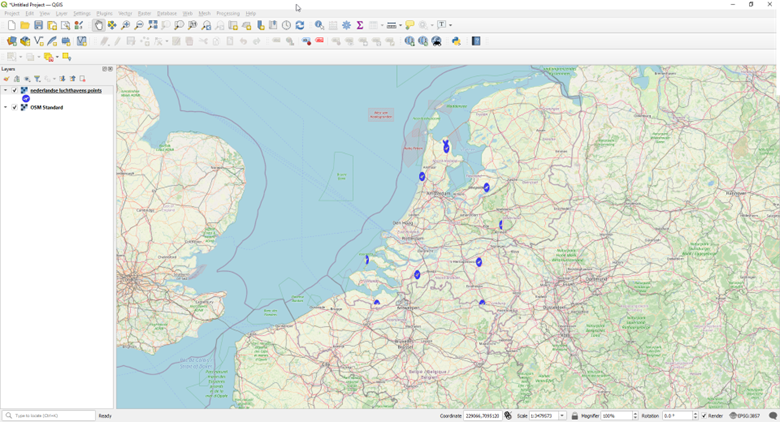

To add a WMS layer to QGIS, a connection to the WMS has to be defined. Go to Layer/Add layer and select Add WMS/WMTS layer

 
Click New to define the WMS connection. 

 
Use a name, the URL can be copied from Dataplatform and click OK. Then click Connect and select the layer from the list of layers which appears. The name can be found in Dataplatform as well. 

 
And click Add to add the layer to the map. 

