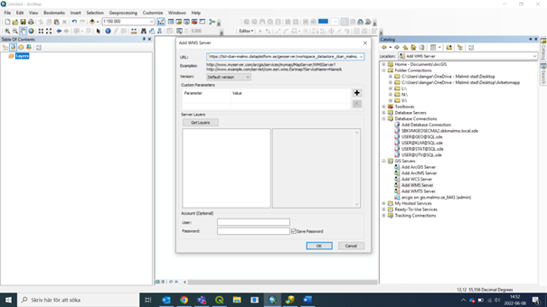
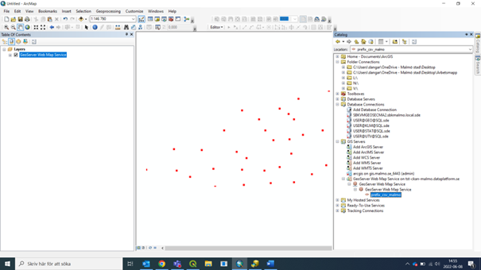
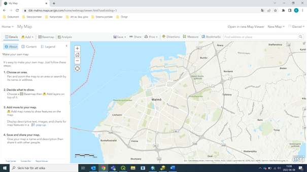

## Add WMS in ArcMap

Open _Catalog_: (or go through the application _ArcCatalog_):

---

Click ”Add WMS Server” and enter the link to the server:

---

Optional: Click “Get Layers” to verify if the link is correct and if ArcMap can reach the server:

---

Once added to the server list you can add layers to the map:

---

## Add WMS to ArcGIS Online (and ArcGIS Portal/Enterprise)

Go to your map, or create a new one:

---

Click “Add” and chose “Add layer from web”:

---

Choose “A WMS OGC Web Service” and enter the link and click “Add layer”:

---
