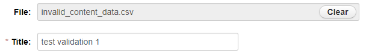
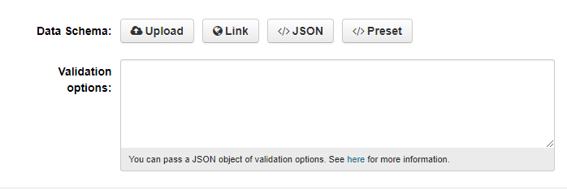
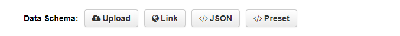
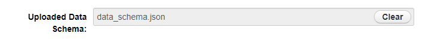
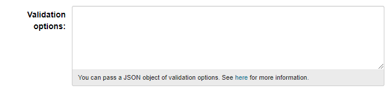
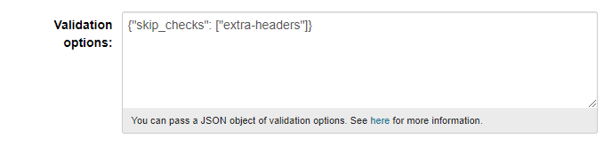
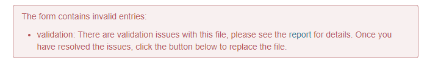
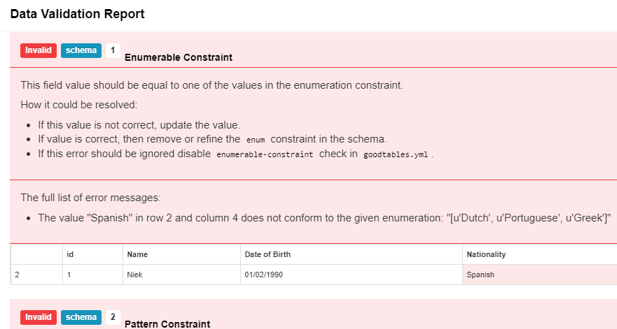
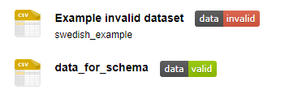

This page will get you started with validating your data.

Choose the environment where you want to start validating your data:

* **[Dataplatform CKAN](validation_GettingStarted#dataplatform-ckan)**: Validate your first dataset in CKAN.
* **[Online Validation Tool](validation_GettingStarted#online-validation-tool)**: Validate a file online, quick and easy!

If you are looking to learn how to ***create a custom data schema***, ***[see here](validation_GettingStarted#create-data-schema)***. 

## Dataplatform CKAN

>This documentation assumes a basic understanding of the CKAN functionalities, more precisely ***Adding of Datasources/Resources***.
>For more info see **[Adding Datasources documentation](datasets_AddingDatasources)** 

The following Step by Step guide will allow you to add a Resource and a Schema to your CKAN instance and validate it accordingly.

### Adding a Resource
- Start by navigating to the "create resouce" page in any of your datasets.

- Provide a file with the data you want to validate using the field "*File*". You can use one of the ***[example files](validation_GettingStarted#tabular-data)*** to start. To see the validation in action is nice to start with some ***invalid data***.

- Provide a title to the Resource (e.g. "*test validation 1*")

- You should also see the following fields "***Data Schema***" "***Validation Options***". 

> ***Note***: If you don't see the "Data Schema" and "Validation Options" fields, please **contact your administrator** to confirm that the validation service is provided in your CKAN instance. 

### Providing the Data Schema

The Data Schema is going to be the document that sets the restrictions on the data you are validating.

The schema defined must follow the specifications of ***Table Schema*** (<a href="https://frictionlessdata.io/specs/table-schema/" target="_blank">docs</a>).

   - The Data Schema can be provided in 4 ways:
       - ***Upload*** - Upload the JSON file with the schema.
       - ***URL*** - Link to a JSON file with the schema.
       - ***JSON*** - The actual JSON representation in text.
       - ***Preset*** - Choose one of the options available. These options are configured by the CKAN administrator.

> To start you can use the example ***data schema***, [see Example Files](validation_GettingStarted#data-schema) 

### Providing the Validation Options

Validation Options can be used to add or remove specific checks, control limits, etc.

- Use this ***[Validation Options](assets/Dataplatform/Validation/validation_options.json)*** by **copy/paste** it to the field. - This will ignore all extra headers provided in the data  that were not defined in the data schema.

> As a default, the meta data field Validation options will have the following value: `{ "checks": [ "schema" ] }`. When a schema is provided, it will check against this schema. **If however no schema is provided, the default behavior is that the datasource will get a data valid label.** 

### Validation Report

- Once all fields required are filled press the "***Add***" button to submit the resource.
 
There will be a validation report generated based on the ***data***, ***data schema*** and ***validation options*** provided.

Depending on the mode of operation, you might not be able to add the resource until it passes the validation checks. See ***[Modes of Operation](validation_GettingStarted#modes-of-operation)*** for more info.

#### Modes of Operation

There are two possible modes in which the validation operates:

- ***Asynchronous validation*** - Run in the background whenever a resource of a supported format is created or updated. Validation **won't affect the action performed**, so if there are validation errors found the reource will be created or updated anyway.

- ***Synchronous validation*** - Performed at the same time a resource of the supported formats is being created or updated. Currently, **if data validation errors are found**, a ValidationError will be raised and **you won't be able to create or update the resource**.

> To know in which mode is the validation operating on your instance contact your administrator. ***Tip***: Try to submit an invalid resource and see if the operation was successful.  

For more information see [official documentation](https://github.com/frictionlessdata/ckanext-validation#operation-modes-1).

#### Validation Report Format

- When using the *Synchronous validation* the validation error thrown will look like this:

- Clicking on the "*report*" hyperlink inside the validation error message, will show you the validation overview. This includes a list of all errors grouped by type, and the details of each error.

You can read the full specification of the validation report format **[here](https://github.com/frictionlessdata/goodtables-py#validation-report-format)**, in the UI the report will look like this:

- When a validation is performed on a resource, a label will be added in the UI with the proper result. You can click on these labels to be redirected to the Data Validation Report Page.

### API Documentatition

In order to interact with the validation through the [CKAN API](https://docs.ckan.org/en/2.8/api/), you can [see API Documentation](https://github.com/frictionlessdata/ckanext-validation#action-functions).  

## Online Validation Tool
 
Goodtables provides a web service where you can try the validation online.

><a href="http://try.goodtables.io/" target="_blank">Goodtables Web Service</a>, see the <a href="https://frictionlessdata.io/docs/validating-data/#goodtables" target="_blank">official documentation here</a>.

Completing your first validation:
* Go to the ***<a href="http://try.goodtables.io/" target="_blank">Validation Tool</a>***.
* Provide a tabular data file to validate by referring to a ***URL*** or ***uploading a file*** (***[example files](validation_GettingStarted#tabular-data)***).
* (**optional**) Provide a data schema to validate the data with. ***[Create one](validation_GettingStarted#create-data-schema)*** or use the ***[example](validation_GettingStarted#data-schema)***.
* Check/Uncheck options *"ignore blank rows"* and *"ignore duplicate rows"* according to your needs.
* Click the ***Validate*** button.
* Analyze your completed validation report.

You can also use your own files and apply the corrections to the files, try to upload again and check the results.

## Create Data Schema

To get more information about creating your custom data schema, see ***<a href="https://github.com/frictionlessdata/ckanext-validation#data-schema" target="_blank">ckanext-validation documentation </a>***. 

## Example Files

In this section you can find files to help you getting started faster with some examples.

### Data Schema

   - ***[Simple Schema](assets/Dataplatform/Validation/Data_Schema.json)*** - This schema contains restrictions for the different basic date types like **strings**, **dates**, **coordinates** and **lists**. 
 
### Tabular Data 

The files available bellow are labeled "*valid*" or "*invalid*" according to the "***Simple Schema***" provided above.

   - ***[Valid Data](assets/Dataplatform/Validation/data_for_schema.csv)*** - Data respects the restrictions set in the data schema.  
   - ***[Invalid Data (structure)](assets/Dataplatform/Validation/invalid_structure_data.csv)*** - Data contains invalid structure (<a href="https://github.com/frictionlessdata/goodtables-py#structural-checks" target="_blank">see more</a>).  
   - ***[Invalid Data (content)](assets/Dataplatform/Validation/invalid_content_data.csv)*** - Data contains invalid content (<a href="https://github.com/frictionlessdata/goodtables-py#content-checks" target="_blank">see more</a>).
   
### Validation Options 

> ***This only applies to the CKAN Validation scenario.***

- ***[Validation Options](assets/Dataplatform/Validation/invalid_content_data.csv)*** -  Define which data checks to skip or make (<a href="https://github.com/frictionlessdata/ckanext-validation#validation-options" target="_blank">see more</a>).
