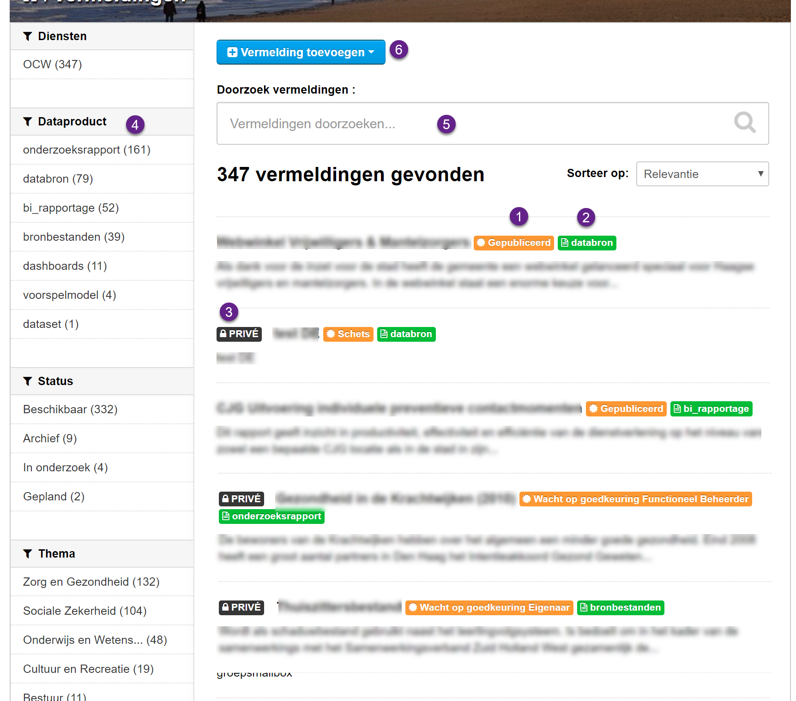
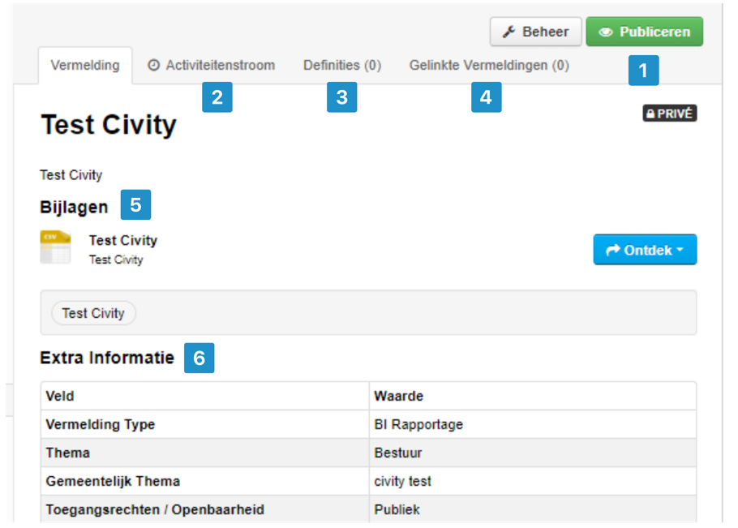

## DataCatalog – a short introduction

DataCatalog is the solution to organize data management within the organization. Insight into metadata motivates data use and application, supporting your organization’s data driven approach and/or policy making.

DataCatalog provides insight into the ownership and management of the data and who uses the data for what purpose. It helps the data owners and managers to describe, maintain and visualize the data and information products in a structured manner. Within DataCatalog, separate data sources can be described, such as the available sports facilities, but also combined information products, such as a dashboard social domain.

DataCatalog includes all components that are present in our Dataplatform solution and adds extra functionality that is aimed at collecting, managing and accessing existing information within your own organization in a secure way. Access as open data on the Dataplatform portal remains possible.

The images below give a global impression of the possibilities of DataCatalog:

**1. Workflow options** - Organizations can decide for themselves who is allowed what and how the process is set up.

**2. Activity Stream** - Each action (who does what, when) is recorded.

**3. Definitions** - Overview of definitions used for the product in question.

**4. Linked Datasets** - Other sources associated with the product in question (used in .. and used by ..)

**5. Data and resources** - Attachments Files or links that refer to the location of the data or information

**6. Metadata** - Overview of all metadata associated with the data or information product.\*

\* the display of the page depends on the role and rights of the user.

---

**1. Workflow options** - Organizations can decide for themselves who is allowed what and how the process is set up.

**2. Activity Stream** - Each action (who does what, when) is recorded.

**3. Definitions** - Overview of definitions used for the product in question.

**4. Linked Datasets** - Other sources associated with the product in question (used in .. and used by ..)

**5. Data and resources** - Attachments Files or links that refer to the location of the data or information

**6. Metadata** - Overview of all metadata associated with the data or information product.

---
