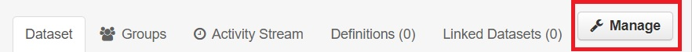

## Delete a listing

Listings, datasets and files that you have created yourself, or a listing, dataset / file of your organization, can be edited. Provided you have the right rights to do so. Members are not allowed to edit listings, datasets and files.

1. Go to the "manage" page of a dataset. This option is located at the top right of the page of the dataset.
2. The page with the metadata appears.
3. Select the "delete" button at the bottom of the page.
4. In a separate screen, a confirmation is requested to delete the dataset. If you want to delete the dataset, click on "confirm".

Listings that are removed, are not immediately disappeared completely from CKAN. Although the listing will no longer appear on CKAN and will no longer appear in search results, the URL still exists. This URL can only be accessed by people with the right rights. When you access this URL, the deleted listing can be recognized by a special 'tag' after the title: [Deleted]. Contact the system administrator to remove the listing completely. Only then can the URL be used again for a new listing.
