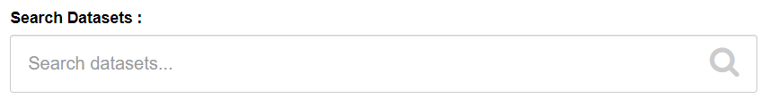
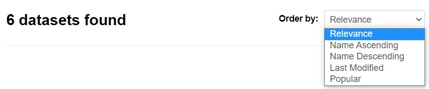

To view listings, it is not necessary to be logged in. CKAN users can login with their user account. Login is required for all edits to the entries.
Anyone accessing the DataCatalogue within the municipality (from an IP address that is on the whitelist) can view the listings.

A listing contains (depending on the dataproduct) data.
This data is metadata.
Metadata are defined in different standards:

- DCAT - for all datasets
- INSPIRE - for geodata
- Independent - own metadata set for the DataCatalogue

For each entry, the following metadata are entered as a minimum:

- Title
- Description
- Organization
- Keywords / tags
- Theme
- Type of data product
- Owner

Based on the entered data, the source can be traced. The owner can be contacted if the original is not freely available. The actual data source do not have to be added to DataCatalog. In DataCatalog, sources are not the basis, but the interpretation of the source: where can you find it, what can you use it for, who collected the data product.

## Search

By using the search bar you can search for:

- (part of the) Title
- (part of) Description
- Tags (Also called Labels or Keywords)

Searching is possible only on a whole word and is case independent. The listings (that meet the search criteria) of all organizations are listed below each other. This list can be sorted in different ways.

## Filtering

On the left side of the page you can filter the datasets based on:

- Published
- Creators
- Organizations
- Themes
- Sub-themes
- Tags
