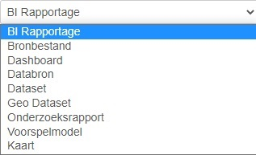

As mentioned earlier, DataCatalog is built in CKAN. This allows data to be organized, published and searched or found.

A listing is a reference to a data product with (a selection of) metadata that belongs to the data product.

Listings can contain the original dataproduct, but a listing can also only be a reference to the original dataproduct. An important part of a listing is the metadata. This describes the dataproduct and makes it easier to find.

## Listing types

Depending on the configuration, there are different listing types. These listing types can be distinguished through the metadata. The default configuration is:

- Resource - A dataset consists of a collection of resources (such as files), along with a description and other information, at a fixed URL.
- Dataset - Datasets is what users see when they search for data.
- Dashboard - Dashboards are a visual representation of business data, often in the form of charts, maps and diagrams.
- BI report - BI stands for Business Intelligence. A BI report is a visual report that combines and integrates data from different sources.
- Source File - A source file is the file that contains the data referenced by a linked file.
- Prediction model - A prediction model uses data cq. statistics to predict possible outcomes in the future.
- Research report - A research report is a document in which the research question, the research method, the research data and the research conclusions are unambiguously recorded.
- Geo Dataset - Geo Datasets are datasets with a spatial component (location).
- Map - A reference to an external map viewer

You can add a new listing by clicking LISTINGS in the main menu.

You then arrive at the first step 'Create a listing'. The metadata of the listing must be entered here.

Step 2 is adding resources. The resources do not have to be the data product itself, but can also be documents that support the metadata. A resource can be a file, but it doesn't have to be. Similarly, a reference to an external link can be used. When you click on a listing, the resources can be found under the heading Attachments.

> File size is limited to a maximum of 500 MB per upload.
