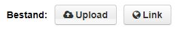

Het aanmaken van een dataset is de eerste stap in het toevoegen van nieuwe data. De tweede stap is [het toevoegen van een databron](datasets_AddingDatasources).

Ga naar Datasets. Bovende zoekbalk zie je een knop 'Dataset toevoegen'. Door op die knop te klikken begin je met het toevoegen van een dataset.  Componenten met een ster zijn verplicht. 


## Titel
> De titel die u kiest, wordt weergegeven als onderdeel van de URL van de gegevensset. De URL wordt gegenereerd in de volgende sjabloon: [https://www.dataplatform.nl/data/YOUR_TITLE](#blank). Wanneer de titel wordt gegenereerd in een URL, worden hoofdletters omgezet in kleine letters en worden spaties vervangen door koppeltekens ( - ). 

Een titel is een unieke identificatie - deze moet kort en specifiek zijn. Zo is  “**Sportevenementen 2016 Utrecht**” veel specifieker dan “**Sportevenementens**.” Voor de beste resultaten geeft u de locatie van de gegevensset in de titel op, omdat gebruikers hierdoor uw gegevensset beter kunnen vinden op <a href="https://www.dataplatform.nl" target="_blank" rel="noreferrer noopener">Dataplatform</a>.

Een goede naamgevingsrichtlijn om te volgen bij het maken van een titel: 
```sh
Basis_categorie - onderwerp - locatie:jaar - versie:nummer 
```
Een voorbeeld aan de hand van onze naamgevingsrichtlijn: 
```sh
Sport - Sportevenementen - Utrecht 2019 - Versie 1 
```


## Beschrijving 
Dit veld vertegenwoordigt een overzicht van uw dataset. Uw beschrijving moet de volgende vragen beantwoorden:

* Waar gaan de gegevens over? 
* Waar komen de gegevens vandaan? 
* Wat is de kwaliteit van de data? 
* Over welke periode of periode werden de gegevens geregistreerd? 

U kunt deze <a href="https://www.markdownguide.org/basic-syntax" target="_blank" rel="noreferrer noopener">opmaak gebruiken</a> in het beschrijvingsveld. 
Hiermee kunt u kopteksten, lijsten, **vet** en *cursief* gebruiken. 

Bijvoorbeeld de volgende ruwe afwaardering: 


```sh
* **Beschrijving:** Sportevenementen Utrecht 
* **Bron:** Afdeling Vergunningen 
* **Doel:** Inzicht geven in gebeurtenissen vanuit de gemeente 
* **Beperkingen:** Deze dataset mag niet worden gebruikt voor juridische doeleinden 
* **Mogelijkheden:** Deze dataset kan gebruikt worden voor inzicht in locaties op een kaart 
* * Coördinaten systeem: * * WGS84 * 
```

Wordt weergegeven als: 

* **Beschrijving:** Sportevenementen Utrecht 
* **Bron:** Afdeling Vergunningen 
* **Doel:** Inzicht geven in gebeurtenissen vanuit de gemeente 
* **Beperkingen:** Deze dataset mag niet worden gebruikt voor juridische doeleinden 
* **Mogelijkheden:** Deze dataset kan gebruikt worden voor inzicht in locaties op een kaart 
* *Coördinaten systeem:* *WGS84* 

### Organisatie
Als u deel uitmaakt van een organisatie, mag u alleen gegevenssets en bestanden toevoegen en beheren die zijn verbonden met die organisatie. dit veld wordt automatisch ingevuld. 

### Visibility / Zichtbaarheid
> Zichtbaarheid is standaard ingesteld op privé. Kies 'openbaar' om de dataset beschikbaar te maken als open data op <a href="https://www.dataplatform.nl" target="_blank" rel="noreferrer noopener">dataplatform.nl</a>

CKAN Dataplatform heeft twee soorten zichtbaarheidsopties: privé en openbaar. Gegevenssets die als **privé**  zijn gemarkeerd, kunnen in  <a href="https://ckan.dataplatform.nl/" target="_blank" rel="noreferrer noopener">CKAN</a> alleen worden bekeken door gebruikers met de juiste organisatierechten; de gegevensset is niet zichtbaar op <a href="https://www.dataplatform.nl" target="_blank" rel="noreferrer noopener">dataplatform</a>.

De zichtbaarheidsstatus van uw gegevensset wordt aangegeven door een label in de rechterbovenhoek. 


### Licentie 

Licenties bepalen hoe uw gegevensset mag worden gebruikt. Informatie over open data licenties vindt u op Conformant Licenses.

Open Data Register publiceert alleen datasets met de volgende licenties: 

><a href="https://creativecommons.org/publicdomain/zero/1.0/" target="_blank" rel="noreferrer noopener">CC-0</a> /
><a href="https://creativecommons.org/licenses/by/3.0/" target="_blank" rel="noreferrer noopener">CC-BY 3.0</a> /
><a href="https://creativecommons.org/licenses/by/4.0/" target="_blank" rel="noreferrer noopener">CC-BY 4.0</a> /
><a href="https://opendatacommons.org/licenses/pddl/summary/" target="_blank" rel="noreferrer noopener">Public Domain</a>
*Als u een andere licentie nodig heeft, neem dan contact op met de beheerder van Dataplatform.* 

Licenties worden geselecteerd door op de vervolgkeuzelijst te klikken; u moet een optie selecteren. 

De standaardlicentie voor open data is 'Creative Commons CC Zero'. Dit betekent dat de dataset onbeperkt gebruikt mag worden. Met de licentie "Creative Commons Attribution" kunnen gebruikers uw gegevens vrij gebruiken, maar ze moeten verwijzen naar de bron van de gegevens. 


### Trefwoorden 

Het is raadzaam om tags in te voeren die niet voorkomen in de beschrijving of titel van uw dataset. Dataplatform indexeert al trefwoorden in de velden Titel en Beschrijving. 

Tags beïnvloeden zoektermen. Het gebruik van tags maakt uw datasets gemakkelijker te vinden. Door de eerste paar letters van uw beoogde tag in te voeren, zoekt Dataplatform naar de dichtstbijzijnde bestaande overeenkomst - als deze overeenkomt, klikt u op de tag in de vervolgkeuzelijst. 

Als uw beoogde tag niet overeenkomt met bestaande vermeldingen, vult u het hele woord in en drukt u  op de  enter-toets. Zodra uw nieuwe tag is ingevoerd, is het nu mogelijk om deze als een bestaande tag te gebruiken. Als u de verkeerde tag selecteert, kunt u deze verwijderen door op het kruisje "X" voor het woord te klikken.


### Taal 
De standaardtaal is ingesteld op Nederlands, maar extra opties zijn beschikbaar in de vervolgkeuzelijst.  Andere opties zijn: Engels, Fries, Germen


###  Metadata Taal 
De standaardtaal is ingesteld op Nederlands, maar extra opties zijn beschikbaar in de vervolgkeuzelijst.  

<!-- 
## Tags
> It is advisable to enter tags that do not appear in the description or title of your dataset. Dataplatform already indexes keywords in the Title and Description fields.

Tags influence search terms. Utilizing tags will make your datasets easier to find. Entering the first few letters of your intended tag will make Dataplatform search for the closest existing match – if it matches, click on the tag in the dropdown list.

If your intended tag does not match any existing entries, complete the entire word, then hit the *return* key. Once your new tag has been entered, it is now possible to use this as an existing tag.
If you select the wrong tag, you may remove it by click on the cross “X” in front of the word.

 -->


### Thema 

Categorieën zijn vooraf gedefinieerd. U moet de beste match/overeenkomst in de lijst selecteren.  Hier kunt u kiezen uit een gestandaardiseerde lijst, op te vragen bij data.overheid. U kiest het thema dat het beste bij de dataset past. 


### Verstrekker 

Hier schrijf je op welke entiteit verantwoordelijk is voor het onderhoud en de publicatie van de dataset. 


### Type contactpunt 

Hier kunt u selecteren of de entiteit die verantwoordelijk is voor het onderhoud en de publicatie van de gegevensset een organisatie of een individu is. 


## Naam contactpunt 
De eigenaar van de dataset, meestal is dit een organisatie (provincie, ministerie, gemeente, etc). 

Als u in het Open Data Register wilt worden opgenomen, moet de naam in ‘Naam contactpunt’ overeenkomen met de naam die aan de overheidsinstantie in het Open Data Register is gegeven. De lijst met organisaties is hier te vinden:  <a href="https://data.overheid.nl/data/organization" target="_blank" rel="noreferrer noopener">Organizations</a>.

<!-- ## Version
> Every dataset may be given a version number

Incrementing the version number on each subsequent edit will allow users to see whether there have been previous data sets, which are no longer viewable. -->


### E-mail contactpunt 
Dit is de e-mail van de organisatie, waarmee gebruikers contact met u kunnen opnemen als ze vragen of opmerkingen hebben. Dit is meestal een algemeen e-mailadres. 


### Toegangsrechten/openbaarheid 

Toegangsrechten kunnen informatie bevatten over toegang of beperkingen op basis van privacy-, beveiligings- of ander beleid. 


### Updatefrequentie 

Hiermee stelt u de updatefrequentie van uw gegevensset in. 


### Publiceren Geoserver 

Als de dataset georuimtelijke gegevens bevat, kunnen deze worden overgebracht naar GeoServer. 


### Publiceren Geonetwork 

Als u ervoor heeft gekozen om te publiceren in GeoNetwork, kunnen de gegevens ook worden overgedragen aan NGR (Nationaal Georegister). 


### Opslaan  

Onderaan het metadataschema staan twee opties voor het opslaan van de gemaakte metadata. De opties zijn 'Opslaan zonder data' of 'Volgende: Data toevoegen'. 

Met de eerste optie, 'Opslaan zonder data', slaat u alleen de metadata op. Zo kunnen ze vinden dat er een dataset is en wie de eigenaar is. Maar als ze toegang willen, moeten ze contact opnemen. 

Met de tweede optie, 'Volgende: Data toevoegen', is er de mogelijkheid om de datafiles toe te voegen. 


### Gegevens toevoegen 

Nadat de metadata is beschreven, kan een bestand worden toegevoegd. Klik op de knop 'Volgende: Data toevoegen'. 

Op deze pagina kunnen één of meerdere bestanden ("scources") aan de dataset worden toegevoegd. Er zijn twee manieren om een bestand toe te voegen: 
    *Door een bestand te uploaden 
    *Door te linken naar een bestand (locatie) 




Als er een CSV-bestand of (geo)JSON wordt toegevoegd (zowel uploaden als linken), wordt het bestand opgeslagen in de datastore van het dataplatform en toegankelijk als API. Andere bestandsindelingen worden opgeslagen als een bestand en zijn beschikbaar om te downloaden. 

Voeg de overige informatie over het bestand toe: 
1. Naam: geef een onderscheidende naam aan het bestand. 
2. Beschrijving : leg de inhoud van het bestand uit. 
3. Formaat – Het formaat waarin de bron wordt geleverd, bijvoorbeeld.CSV (door komma's gescheiden waarden), XLS, JSON, PDF enz. Dit veld kan leeg blijven. CKAN bepaalt het formaat zelf op basis van de extensie. 

Als u meerdere bestanden (uploaden of links) aan de dataset wilt toevoegen, kiest u "opslaan en nog een toevoegen". Als u slechts één bestand aan de gegevensset toevoegt, kiest u 'voltooien' 

CKAN slaat het bestand op en maakt de gegevensset. Het resultaat wordt onmiddellijk weergegeven. Als de gegevensset openbaar toegankelijk is, wordt het resultaat ook weergegeven op dataplatform.nl. Datasets die privé zijn, zijn niet zichtbaar op Dataplatform. 

Your dataset is now complete 🎉👍
