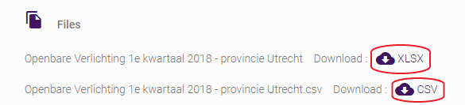

Er zijn verschillende manieren om een dataset te downloaden. 

 ## Gebruikersportaal 

 1) Als u op het tabblad 'Gegevens' klikt, ziet u alle beschikbare datasets. Ze worden elk weergegeven in een vierkant, dat de nodige informatie bevat. Aan de rechterkant van het plein zie je een 'download'-bord. Door erop te klikken komt u op de pagina met alle downloadbare bestanden en eindpunten. Doorop de cloud achter het bestand te klikken, kunt u het bestand downloaden. 

 2) Als u  op een dataset hebt geklikt om erachter te komen of deze de juiste is, kunt u naar het downloadtabblad gaan. Daar vindt u alle bestanden om te downloaden. 

 ## Op het Dataplatform 

 Ga naar de Dataset. Achter de dataset/databron klinkt u op Ontdekken. Er komt een dropdown-menu waar u kiest voor ‘ Download’. 