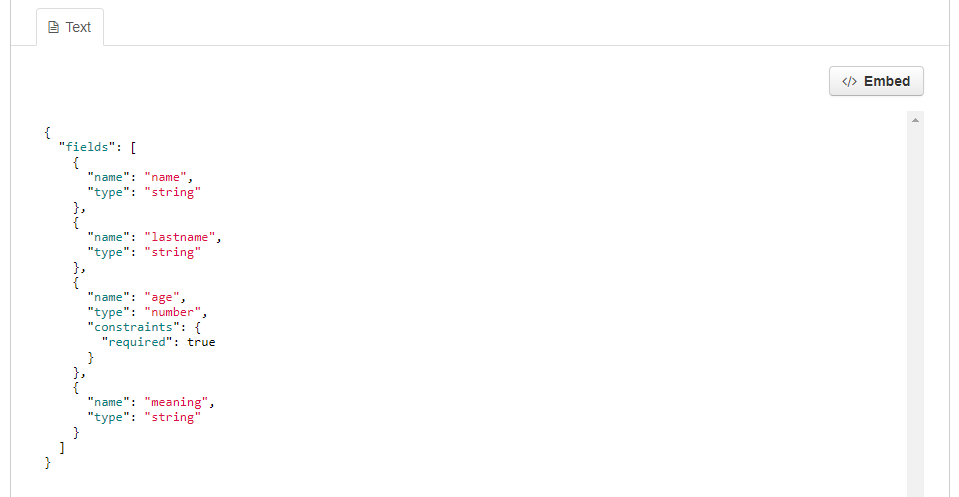

> De CKAN-bronpagina kan een of meer visualisaties van de brongegevens of bestandsinhoud bevatten (een tabel, een staafdiagram, een kaart, enz.). Deze worden gewoonlijk resourceweergaven genoemd. 

## Preview in CKAN

Verschillende plug-ins zijn opgenomen in Dataplatform CKAN om een voorbeeld van verschillende bronbestandstypen te bekijken: 

* Gegevensverkenner 

    De gegevensverkenner bestaat uit een ***raster-***,***grafiek-*** en ***kaartweergave***
    
    * Rasterweergave: geeft een tabel weer voor tabelgegevens (CSV/XLS/XLSX)
    * Grafiek: verschillende opties om een grafiek weer te geven voor CSV/Excel-bestanden
    * Kaartweergave: toont een kaart voor CSV-, Excel- of GeoJSON-bestanden die geografische coördinaten bevatten. 

    ***Opmerking:*** Deze plug-in vereist gegevens in de [DataStore](datasets_AddingDatasources#datastore)

* Tekstweergave 
    * Kan platte tekstbestanden, JSON- of XML-bestanden weergeven (kan afhankelijk zijn van de configuratie van de plug-in)

* Afbeeldingsweergave
    * Is geconfigureerd om PNG-, JPEG- of GIF-bestanden weer te geven

Meer informatie over het bekijken van gegevensbronnen is te vinden in <a href="https://docs.ckan.org/en/2.8/maintaining/data-viewer.html" target="_blank">CKAN documentatie</a>

### FAQ

#### V: Waarom is er geen weergave, hoewel een weergave volgens de documentatie moet worden weergegeven?

**A:** Voor tabelgegevens (d.w.z. csv-/xls-bestanden) wordt de tabelweergave automatisch toegevoegd wanneer deze bestanden worden geüpload naar het gegevensarchief, wat een vereiste is voor het laden van een gegevensverkennerweergave. Dit zou altijd moeten werken als een csv / Excel-bestand wordt geüpload via de normale CKAN-gebruikersinterface. Als dit echter via een API-aanroep gebeurt, kan het zijn dat sommige parameters ontbreken (het bestandstype is bijvoorbeeld niet opgegeven), waardoor de tabelweergave niet kan worden gemaakt. Als dit het geval is, volgt u de onderstaande stappen om een weergave te maken.

#### Q: Hoe kan ik een weergave toevoegen?
**A:** U kunt een weergave toevoegen door naar: ***Manage***->***Views***->***New View***-> ***Data Explorer*** te gaan.

---

## Preview Portal

Op het portaal is er een ***tabelweergave*** en een ***kaartweergave***: 

#### Tabelweergave

Op de portal wordt automatisch een tabelvoorbeeld toegevoegd voor CSV-bestanden. De tabel toont maximaal 100 items per pagina.

#### Kaartweergave

Wordt weergegeven wanneer ***Geo-Enabled*** is ingesteld op ja en coördinaten zijn inbegrepen. 

#### CSV-bestand

Voor CSV-gegevensbronnen worden de eerste 100 records/items weergegeven. Als u  onder de kaartweergave op Tabel weergeven klikt. U kunt naar de volgende 100 items gaan of teruggaan naar de vorige. 

#### GeoJSON

GeoJSON-gegevensbronnen tonen alle records tegelijk op de kaart. Zie het voorbeeld hieronder. 

> **Opmerking**: Het  veld ***Geo-enabled*** metagegevens kan worden ingesteld op ***Ja*** voor elk type bron. Daarom is deze optie standaard ingesteld op ***Nee*** en moet deze alleen op ***Ja*** worden ingesteld  voor gegevensbronnen die op een kaart kunnen worden weergegeven.

### FAQ

#### V: Ik heb het veld Geo-Enabled ingesteld op Ja, waarom wordt de kaart nog steeds niet correct weergegeven in de portal?

**A:** Zorg ervoor dat u de volgende dingen controleert: 
*   Gebruikt u een van de bestandstypen die de kaartfunctionaliteit ondersteunen (d.w.z. CSV of GeoJSON)?
*   Bestaat het CSV-bestand uit geometriekolommen en voldoen de kolomnamen aan de standaardveldzoekwoorden? Zie documentatie over [beheren van geometriekolommen](datasets_ManageGeometryColumns)
*   Mist uw gegevensbron waarden?

