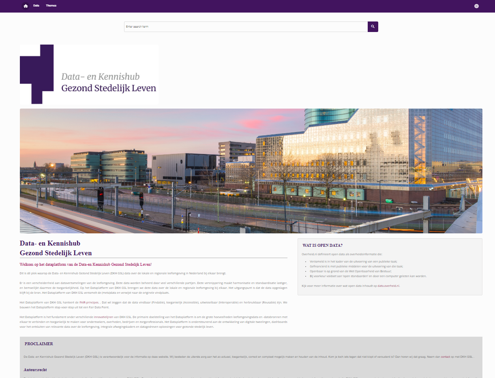
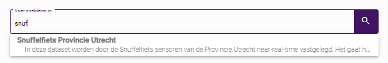
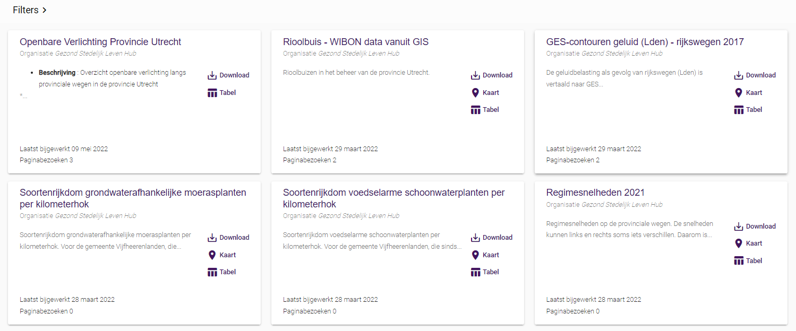
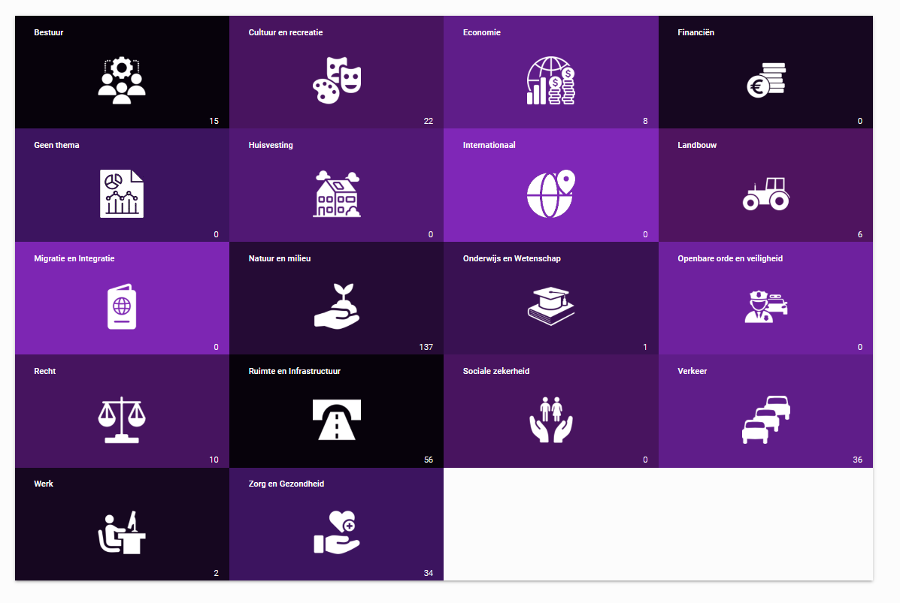

De Portaal biedt een homepage waar u uw doelen, showcases en verhalen kunt benadrukken. Er is een aparte pagina met alle datasets, gepresenteerd als kaarten. Via de filter- en zoekopties kunnen gebruikers eenvoudig naar een dataset navigeren. De gegevens kunnen ook worden gerangschikt volgens de thema's of organisaties / afdelingen. 

De datasets worden altijd getoond met de metadata, een downloadoptie en een contactformulier. Indien van toepassing wordt ook een tabel, kaart of API verstrekt. 

## Homepage
De homepage van het portaal biedt een inleiding tot de pagina.  Het geeft ook een toelichting op het beleid voor klanten (gebruiksvoorwaarden). 

## Zoeken
De zoekbalk biedt automatische aanvulling. Begin met typen om suggesties te krijgen, op basis van de titel, beschrijving of tags. 

## Overzicht datasets 
Wanneer u op 'Data' klikt krijgt u een overzicht van alle mogelijke databestanden. Elk gegevensbestand bevat details en weergaveopties. In het gedeelte met het overzicht van de gegevensset kunt u de zoekresultaten verder verfijnen. 

### Filters 
De filteropties op de pagina gegevenssets bieden verschillende manieren om naar bepaalde gegevenssets te zoeken. Voor elke filteroptie is er een vervolgkeuzemenu. 

Actieve filters worden weergegeven. Met de optie "Verwijderen" worden alle filters verwijderd. Het is ook mogelijk om afzonderlijke filters te wissen, door op het kruisje achter de actieve filter te klikken. 

<table class="table-imageStyles">
    <tbody>
        <tr>
            <td>
                
            </td>
        </tr>
    </tbody>
</table>

### Gegevenssets Details 
Hiermee worden verschillende aspecten van de geselecteerde gegevenssets weergegeven. 

De volgende weergaveopties zijn beschikbaar: 
1. Informatie 
2. Tabelweergave 
3. Kaartweergave 

Er zijn extra tabbladen mogelijk voor: 
4. Downloaden 
5. Contactformulier 

Als u op een van de datasets klikt, krijgt u meer informatie over die set. De informatie bevat een beschrijving, tags, metadata en statistieken. 

### 1. Informatie display 

Als u op informatie klikt, zijn de volgende categorieën informatie beschikbaar: 

* Beschrijving 
* Tags 
* Metagegevens 
* Statistiek 

** Beschrijving ** : Hier vindt u informatie over wat de gegevens inhouden, waar de informatie vandaan komt en wat gebruikers moeten weten over de gegevens. 

** Tags ** : De tag biedt aanvullende informatie over het bestand waaraan het is gekoppeld, waardoor op trefwoorden gebaseerde classificatie en indexering mogelijk is. 

Hier vindt u de zoektermen die zijn toegevoegd om het gemakkelijker te maken om de dataset te vinden. 

** Details van metagegevens van gegevenssets ** : Als u op metagegevens klikt, worden in een vervolgkeuzemenu alle kenmerken van het bestand weergegeven. Het metadataschema van de portal bevat een gestandaardiseerde set verzamelde metadata op de basis van DCAT. Hierdoor kunnen alle open gegevens die in een instantie beschikbaar zijn en als "openbaar" zijn geclassificeerd, automatisch worden weergegeven in de nationale gegevensregisters (NL: data.overheid.nl; SE: oppnadata.se) en het EU-portaal.  En de metadata bevat informatie over geodata. Die is nodig voor het doorsturen van de gegevens naar NGR (Nationaal georegister). 

** Statistieken **: Hier vindt u de statistieken over het gebruik van datasets. 

 
### 2. Tabel 

Hier vindt u alle opgeslagen datasets.  Als u op het 'oog'-pictogram drukt, ziet u de details van die dataset.   Er is ook de mogelijkheid om de datastore-tabel te downloaden. Meer informatie is te vinden over de dataset onder de metadata en het datawoordenboek. 

Data Dictionary : Het Data Dictionary is een module die wordt gebruikt om de inhoud van een dataset nauwkeurig te beschrijven. Vaak zijn de kolomnamen die standaard in een dataset voorkomen niet erg duidelijk voor een nieuwe gebruiker. Het gegevenswoordenboek herkent automatisch kolommen in een gegevensset en geeft het gegevenstype per kolom op; en bovendien toestaan dat een etiket en beschrijving worden toegevoegd om de inhoud verder te verduidelijken. 

### 3. Kaart 

Dit is een presentatie van (geografische) data in een map viewer. 

### 4. Downloaden 

Hier kunt u de dataset en de API's downloaden.  Het vertelt u welk formaat het bestand van de dataset is.  

### 5. Contactformulier 

Bij sommige partalen is er een contactformulier aanwezig bij een dataset. Hier vindt u een formulier waar u vragen  over de dataset kunt achterlaten. 

### Thema's
Thema's zijn gebaseerd op benodigde items uit de DCAT-standaard. Het klikken op een thema fungeert als een filter, om de relevante datasets te tonen. Het aantal dat bij elk thema wordt weergegeven, verwijst naar het aantal datasets.

### Taal selectie
Als u op de knop boven u drukt, toont u een vervolgkeuzemenu met de mogelijke talen waaruit u kunt kiezen. Op dit moment zijn er drie mogelijke talen om uit te kiezen: Zweeds, Engels en Nederlands. Als er andere talen nodig zijn, neemt u contact op met de ontwikkelaar. 