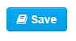
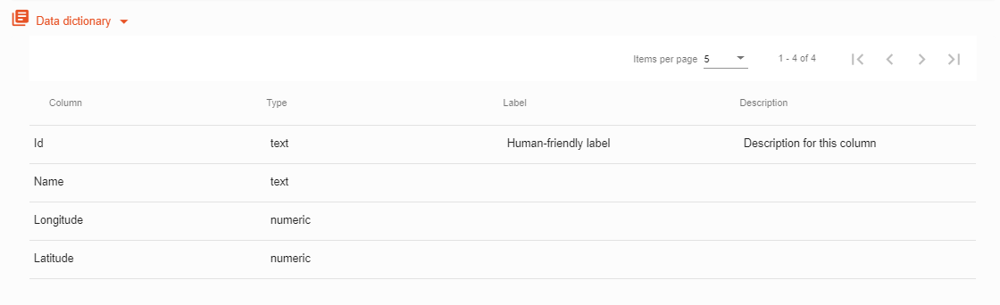

> Het Data woordenboek is een module die voor specifieke bestandstypen automatisch kolomnamen en gegevenstypen detecteert die in deze specifieke kolommen worden gebruikt.  

## Wat kan ik doen met het Data woordenboek?

Het Data woordenboek kan worden gebruikt om de inhoud van een dataset explicieter te beschrijven aan de hand van labels en beschrijvingen. 

Met het formulier Data woordenboek kunt u de volgende waarden voor elke kolom invoeren: 
*	Type Override: het type dat moet worden gebruikt de volgende keer dat DataPusher wordt uitgevoerd om gegevens in deze kolom te laden
*	Label: een mensvriendelijk label voor deze column 
*   Beschrijving: een volledige beschrijving voor deze kolom in markdown-formaat

#### Tabel met Data woordenboek in CKAN:

## Heeft elke gegevensbron een Data woordenboek?

Nee, alleen bepaalde bestandstypen ondersteunen de functionaliteit van het Data woordenboek. Momenteel ondersteunde bestandsindelingen voor gegevensbronnen in Dataplatform zijn: **CSV**, **XLS** en **XLSX**. 

Als de gegevensbron correct is geüpload naar de [DataStore](datasets_AddingDatasources#datastore), wordt de tabel Gegevenswoordenboek toegevoegd. 

## Waar kan ik het datawoordenboek vinden? 

Het data woordenboek kan zowel in **CKAN** als op de **portal** worden bekeken. 

#### CKAN: 
Klik op een dataset -> klik op een databron
#### Portal
Klik op een dataset -> Klik op het tabblad *Tabel* -> Klik op *Data woordenboek*

## Het Data woordenboek van een gegevensbron bewerken

> Het Data woordenboek kan worden bewerkt binnen uw CKAN-instantie

#### 1.  Klik in een dataset op de knop *‘Ontdek’* van de gegevensbron die u wilt bewerken en klik vervolgens op *‘Bijwerken’*.

#### 2. Ga naar het tabblad *Data woordenboek*

#### 3. Bewerk type / label / beschrijving

#### 4. Klik ten slotte op de knop ‘Bewaar’ hieronder
    

#### Wijzigingen zoals weergegeven in de Portal:

