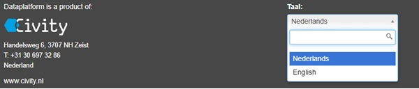

Hier vind je een overzicht van wat CKAN is, naast wat je met CKAN kunt bereiken.
## CKAN 

DataPlatform maakt gebruik van de open source software CKAN. Dit is wereldwijd de meest gebruikte software voor open data-omgevingen. 

CKAN staat voor "Comprehensive Knowledge Archive Network", een <a href="https://en.wikipedia.org/wiki/Web_application" target="_blank">web-based</a>, <a href="https://en.wikipedia.org/wiki/Open-source_software" target="_blank">open-source</a> managementsysteem voor de opslag en distributie van <a href="https://en.wikipedia.org/wiki/Open_data" target="_blank">open data</a>.. 

Het DataPlatform maakt gebruik van een CKAN-instantie als onze webgebaseerde tool voor het onderhoud van datasets, databronnen en metadata. 

De CKAN-instantie is te vinden op <a href="https://ckan-dataplatform-nl.dataplatform.nl/" target="_blank">ckan-dataplatform-nl.dataplatform.nl</a>. 

De CKAN-omgeving van DataPlatform bevat extra uitbreidingen zoals de DataStore (API), Data Dictionary (Data woordenboek) en GeoServer. 

## Taalkeuze
>De taalkeuze bevindt zich in de voettekst.

CKAN ondersteunt vele Europese talen. Momenteel is het Nederlandse CKAN DataPlatform beschikbaar in het Nederlands en Engels;  

<!-- Het Zweedse Dataplatform is beschikbaar in het Zweeds (Svenska) en Engels. -->
 
<!--  -->
 

## Datasets  
> Datasets worden beheerd op <a href="https://ckan-dataplatform-nl.dataplatform.nl/" target="_blank">https://ckan-dataplatform-nl.dataplatform.nl/</a> en gepresenteerd via het Open Data Portaal: `https://{organisatie}.dataplatform.nl`

CKAN maakt gebruik van 'datasets' om data te organiseren (in CKAN *packages* genoemd). Een dataset is een pakket met data, bijvoorbeeld 'de criminaliteitscijfers in de stad' of 'de vochtigheidsmetingen van een weerstation'. Wanneer de gebruiker naar data zoekt, zijn de resultaten zichtbaar in de afzonderlijke datasets.

Datasets bestaan uit twee hoofdaspecten: 
* Metadata 
* Éen of meerdere databronnen 
## Metadata van de datasets 
De metadata bevat informatie over de verzameling van databronnen in de dataset. De metadata geven onder meer informatie over:
* Wie de eigenaar is van de dataset 
* Beschrijvende informatie over de inhoud  
* Toegangsrechten 

## Databronnen 
Een dataset bestaat uit één of meerdere databronnen; dit zijn de feitelijke bestanden of koppelingen die data leveren. Daarnaast is er voor elke databron afzonderlijk ook specifieke metadata die moet worden ingevuld.

## Metadata 
> Metadata is gewoonweg data over data

Elke dataset bevat metadata. Voor open data volgen we de richtlijnen uit de DCAT standaard. 

Metadata is informatie die data over andere data oplevert. Meestal betekent dit een beschrijving en context over bestaande data. 

Zie [Metadata](metadata_Metadata#metadata-example) voor een uitgebreid voorbeeld.
