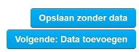

Het aanmaken van een dataset is de eerste stap in het toevoegen van nieuwe data. De tweede stap is [het toevoegen van een databron](datasets_AddingDatasources).

Ga naar het tabblad 'DATASETS'. Boven de zoekbalk zie je een knop 'Dataset toevoegen'. Door op die knop te klikken begin je met het toevoegen van een dataset. 

## Metadata
Het aanmaken van een dataset begint met het toevoegen van metadata. Velden met een asterisk zijn verplicht om in te vullen. 


### Titel

De titel die u kiest, wordt weergegeven als onderdeel van de URL van de dataset. De URL wordt gegenereerd in het volgende formaat: `ckan-dataplatform-nl.dataplatform.nl/dataset/<dataset_id>`. Wanneer de titel wordt gegenereerd in een URL, worden hoofdletters omgezet in kleine letters en worden spaties vervangen door koppeltekens (`-`). 

Een titel is een unieke identificatie - deze moet kort en specifiek zijn. Zo is  “**Sportevenementen 2016 Utrecht**” veel specifieker dan “**Sportevenementen**.” Voor de beste resultaten geeft u de locatie van de dataset in de titel op, omdat gebruikers hierdoor uw dataset beter kunnen vinden op het [open data portaal](portal_Overview)

Een goede naamgevingsrichtlijn om te volgen bij het maken van een titel: 
```sh
Basis_categorie - onderwerp - locatie:jaar - versie:nummer 
```
Een voorbeeld aan de hand van onze naamgevingsrichtlijn: 
```sh
Sport - Sportevenementen - Utrecht 2019 - Versie 1 
```


### Omschrijving 
Dit veld vertegenwoordigt een overzicht van uw dataset. Uw beschrijving moet de volgende vragen beantwoorden:

* Waar gaan de gegevens over? 
* Waar komen de gegevens vandaan? 
* Wat is de kwaliteit van de data? 
* Over welke periode of periode werden de gegevens geregistreerd? 

U kunt <a href="https://www.markdownguide.org/basic-syntax" target="_blank" rel="noreferrer noopener">Markdown syntax</a> in het beschrijvingsveld. 
Hiermee kunt u kopteksten, lijsten, **vet** en *cursief* gebruiken. 

Als voorbeeld, de volgende Markdown syntax..

```sh
* **Beschrijving:** Sportevenementen Utrecht 
* **Bron:** Afdeling Vergunningen 
* **Doel:** Inzicht geven in gebeurtenissen vanuit de gemeente 
* **Beperkingen:** Deze dataset mag niet worden gebruikt voor juridische doeleinden 
* **Mogelijkheden:** Deze dataset kan gebruikt worden voor inzicht in locaties op een kaart 
* * Coördinaten systeem: * * WGS84 * 
```

..wordt weergegeven als: 

* **Beschrijving:** Sportevenementen Utrecht 
* **Bron:** Afdeling Vergunningen 
* **Doel:** Inzicht geven in gebeurtenissen vanuit de gemeente 
* **Beperkingen:** Deze dataset mag niet worden gebruikt voor juridische doeleinden 
* **Mogelijkheden:** Deze dataset kan gebruikt worden voor inzicht in locaties op een kaart 
* *Coördinaten systeem:* *WGS84* 

### Organisatie
Als u deel uitmaakt van een organisatie, mag u alleen datasets en databronnen toevoegen en beheren die zijn verbonden met die organisatie. dit veld wordt automatisch ingevuld. 

### Zichtbaarheid

In Dataplatform zijn er twee soorten zichtbaarheidsopties: 'Privé' en 'Publiek'. Datasets die als 'Privé' zijn ingesteld, kunnen binnen Dataplatform alleen worden bekeken door gebruikers met de juiste organisatierechten; de dataset is niet zichtbaar op het Open Data Portaal.

De zichtbaarheidsstatus van je dataset wordt aangegeven door een label in de rechterbovenhoek. 


### Licentie 

Licenties bepalen hoe uw dataset mag worden gebruikt. Informatie over open data licenties vindt u op <a href="http://opendefinition.org/licenses/" target="_blank" rel="noreferrer noopener">Open Definition</a>.

<!-- Open Data Register publiceert alleen datasets met de volgende licenties: 

><a href="https://creativecommons.org/publicdomain/zero/1.0/" target="_blank" rel="noreferrer noopener">CC-0</a> /
><a href="https://creativecommons.org/licenses/by/3.0/" target="_blank" rel="noreferrer noopener">CC-BY 3.0</a> /
><a href="https://creativecommons.org/licenses/by/4.0/" target="_blank" rel="noreferrer noopener">CC-BY 4.0</a> /
><a href="https://opendatacommons.org/licenses/pddl/summary/" target="_blank" rel="noreferrer noopener">Public Domain</a>
*Als u een andere licentie nodig heeft, neem dan contact op met de beheerder van Dataplatform.*  -->

Licenties worden geselecteerd via een dropdownmenu; u moet een optie selecteren. 

De standaardlicentie voor open data is 'Creative Commons CCZero'. Dit betekent dat de dataset onbeperkt gebruikt mag worden. Met de licentie "Creative Commons Attribution" kunnen gebruikers uw gegevens vrij gebruiken, maar ze moeten verwijzen naar de bron van de gegevens. 


### Trefwoorden 

Het is raadzaam om trefwoorden in te voeren die niet voorkomen in de omschrijving of titel van uw dataset. Dataplatform indexeert namelijk al de trefwoorden in de velden Titel en Omschrijving. 

Trefwoorden beïnvloeden zoektermen. Het gebruik van trefwoorden maakt uw datasets gemakkelijker te vinden. Door de eerste paar letters van uw beoogde tag in te voeren, zoekt Dataplatform naar de dichtstbijzijnde bestaande overeenkomst - als deze overeenkomt, klikt u op het trefwoord in het dropdownmenu. 

Als uw beoogde trefwoord niet overeenkomt met bestaande vermeldingen, vult u het hele woord in en drukt u  op de  enter-toets. Zodra uw nieuwe trefwoord is ingevoerd, is het nu mogelijk om deze als een bestaand trefwoord te gebruiken. Als u het verkeerde trefwoord selecteert, kunt u deze verwijderen door op het kruisje "X" voor het woord te klikken.


### Taal 
De standaardtaal is ingesteld op Nederlands, maar extra opties zijn beschikbaar via het dropdownmenu. Andere opties zijn: Engels, Fries en Duits.

###  Metadata Taal 
De standaardtaal is ingesteld op Nederlands, maar extra opties zijn beschikbaar via het dropdownmenu.  

<!-- 
## Tags
> It is advisable to enter tags that do not appear in the description or title of your dataset. Dataplatform already indexes keywords in the Title and Description fields.

Tags influence search terms. Utilizing tags will make your datasets easier to find. Entering the first few letters of your intended tag will make Dataplatform search for the closest existing match – if it matches, click on the tag in the dropdown list.

If your intended tag does not match any existing entries, complete the entire word, then hit the *return* key. Once your new tag has been entered, it is now possible to use this as an existing tag.
If you select the wrong tag, you may remove it by click on the cross “X” in front of the word.

 -->


### Thema 

Thema's zijn vooraf gedefinieerd op basis van de [Overheid:TaxonomieBeleidsagenda waardelijst](https://waardelijsten.dcat-ap-donl.nl/overheid_taxonomiebeleidsagenda.json). Daarnaast is er de optie om 'Geen Thema' te kiezen. Wanneer je voor 'Geen Thema' kiest zal er een defaultwaarde (Bestuur) worden ingevuld wanneer de data wordt doorgezet naar data.overheid.nl.

### Subthema

Subthema's zijn gekoppeld aan het thema wat erboven gekozen is.


### Verstrekker/Publiceerder 

Hier kies je  de organisatie die verantwoordelijk is voor het beschikbaar stellen van de dataset. De lijst is op basis van de [DONL:Organization waardelijst](https://waardelijsten.dcat-ap-donl.nl/donl_organization.json)


### Registratiehouder / Data-eigenaar

Hier kies je de organisatie die verantwoordelijk is voor de dataset. De lijst is op basis van de [DONL:Organization waardelijst](https://waardelijsten.dcat-ap-donl.nl/donl_organization.json)

### Type contactpunt 

Dit veld geeft aan of een contactpunt een persoon of organisatie is

### Naam contactpunt 
De eigenaar van de dataset, meestal is dit een organisatie (provincie, ministerie, gemeente, etc). 

<!-- Als u in het Open Data Register wilt worden opgenomen, moet de naam in ‘Naam contactpunt’ overeenkomen met de naam die aan de overheidsinstantie in het Open Data Register is gegeven. De lijst met organisaties is hier te vinden:  <a href="https://data.overheid.nl/data/organization" target="_blank" rel="noreferrer noopener">Organizations</a>. -->

<!-- ## Version
> Every dataset may be given a version number

Incrementing the version number on each subsequent edit will allow users to see whether there have been previous data sets, which are no longer viewable. -->


### E-mail contactpunt 
Dit is de e-mail van de organisatie, waarmee gebruikers contact met u kunnen opnemen als ze vragen of opmerkingen hebben. Dit is meestal een algemeen e-mailadres. 

### Telefoon contactpunt
Telefoonnummer van contactpersoon. Optioneel veld.

### Locatie
Keuze van locatie van de dataset.

### Einddatum
Einddatum van de dataset.

### Geografisch gebied
Opties zijn afhankelijk van de gekozen waarde bij het veld Locatie.
### Toegangsrechten/openbaarheid 
Toegangsrechten kunnen informatie bevatten over toegang of beperkingen op basis van privacy-, beveiligings- of ander beleid. 

De lijst is op basis van de [Overheid:Openbaarheidsniveau waardelijst](https://waardelijsten.dcat-ap-donl.nl/overheid_openbaarheidsniveau.json)

### Status
Status van de dataset. De lijst is op basis van de [Overheid:DatasetStatus waardelijst](https://waardelijsten.dcat-ap-donl.nl/overheid_dataset_status.json)

### Uitgiftedatum
Datum waarop de dataset is gepubliceerd.
### Type verandering
Laatste type bewerking van de dataset. De lijst is op basis van de [ADMS:Changetype waardelijst](https://waardelijsten.dcat-ap-donl.nl/adms_changetype.json)

### Geplande datum
Datum waarop dataset beschikbaar komt.
### Updatefrequentie 
Hiermee stel je de updatefrequentie van je dataset in. De lijst is op basis van de [Overheid:Frequency waardelijst](https://waardelijsten.dcat-ap-donl.nl/overheid_frequency.json)

### Versie
Een versienummer of een andere versie-aanduiding voor de dataset.

### Versietoelichting
Bevat een beschrijving van de verschillen tussen deze versie en een eerdere versie van de dataset.

### Ruimtelijk referentiesysteem
Coördinaatstelsel databron. Geo-veld voor NGR.

### Omgrenzende rechthoek
Omgrenzende rechthoek. Geo-veld voor NGR.

### Resolutie
De resolutie van de schaal in meters. Geo-veld voor NGR.

### Toepassingsschaal
De beoogde schaal waarop het bestand waarheidsgetrouw gebruikt mag worden. Dit moet een positief numeriek getal zijn. Geo-veld voor NGR.
### Publiceren Geoserver 
Als de dataset geografische gegevens bevat, kunnen deze worden doorgezet naar GeoServer. 

### Publiceren Geonetwork (NGR)
Werkt alleen als het 'Publiceren Geoserver'-veld op 'Ja' is gezet. De NGR-informatie moet correct zijn ingesteld in de metadata van de organisatie.

###  Publiceren DONL (niet via NGR)
Deze optie wordt genegeerd als de optie geonetwerk is ingeschakeld. NGR zal in dat geval publiceren naar DONL.
## Opslaan  

Onderaan het metadataschema staan twee opties voor het opslaan van de gemaakte metadata. De opties zijn 'Opslaan zonder data' of 'Volgende: Data toevoegen'. 

Met de eerste optie, 'Opslaan zonder data', slaat u de dataset met alleen de metadata op. Er wordt geen databron bijgevoegd.

Met de tweede optie, 'Volgende: Data toevoegen', is er de mogelijkheid om de databronnen toe te voegen. Dit kan middels een externe URL of door een bestand toe te voegen. 




## Databronnen toevoegen 

Nadat de metadata is beschreven, kan data worden toegevoegd. Klik op de knop 'Volgende: Data toevoegen'. 

Op deze pagina kunnen één of meerdere bestanden ("resources") aan de dataset worden toegevoegd. Er zijn twee manieren om een bestand toe te voegen: 

* Door een bestand te uploaden 
* Door te linken naar een bestand via een URL (locatie) 


Als er een CSV, DGN, GeoJSON, GPKG, Shapefile/ZIP, XLS of XLSX wordt toegevoegd (zowel uploaden als linken), wordt het bestand opgeslagen in de Datastore van het Dataplatform en toegankelijk via de DataStore API. Andere bestandsformaten worden opgeslagen als een bestand en zijn beschikbaar om te downloaden. 

Ook bij een databron moet verplichte metadata worden ingevuld: 
1. Titel: geef een onderscheidende naam aan het bestand. 
2. Omschrijving : leg de inhoud van het bestand uit. 
3. Formaat – Het formaat waarin de bron wordt geleverd, bijvoorbeeld.CSV (door komma's gescheiden waarden), XLS, JSON, PDF enz. Dit veld kan leeg blijven. CKAN bepaalt het formaat zelf op basis van de extensie. 

Als u meerdere databronnen (uploaden of links) aan de dataset wilt toevoegen, kiest u "opslaan en nog een toevoegen". Als u slechts één bestand aan de dataset toevoegt, kiest u 'voltooien' 

CKAN slaat het bestand op en publiceert de dataset. Het resultaat wordt onmiddellijk weergegeven. Als de dataset openbaar toegankelijk is, wordt het resultaat ook weergegeven op het Open ata Portaal. Datasets die privé zijn, zijn niet zichtbaar op het Open Data Portaal. 

Je dataset is nu aangemaakt 🎉👍
