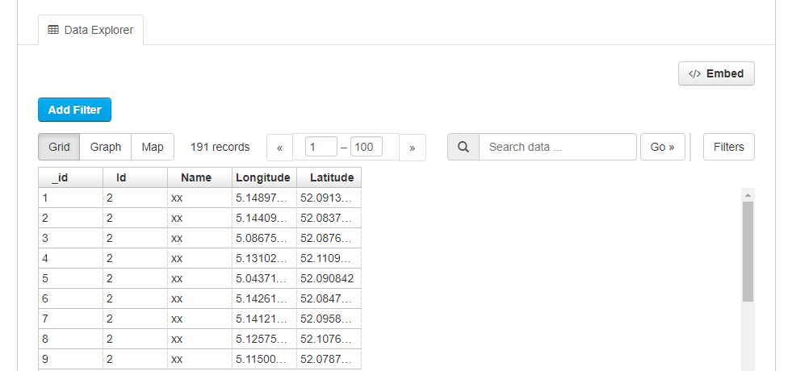
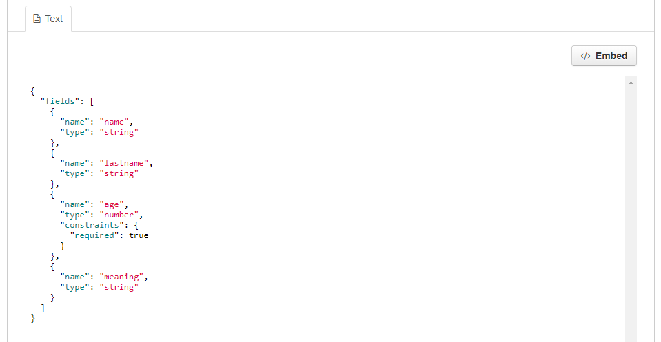
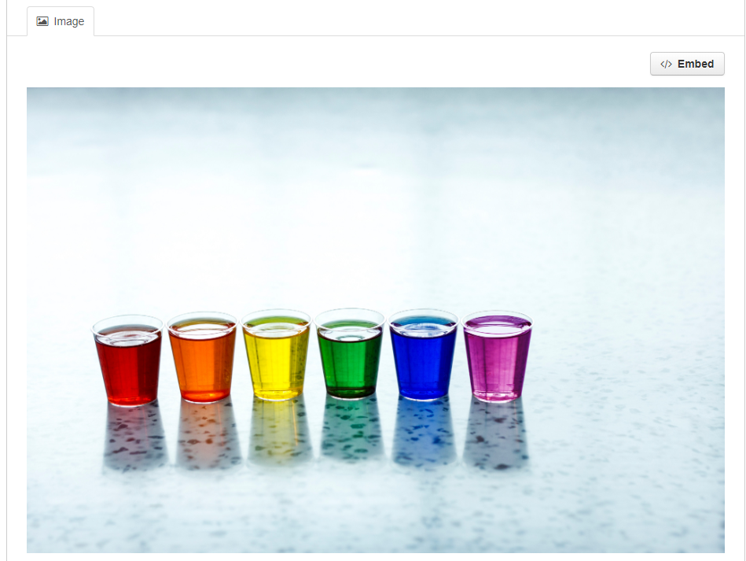
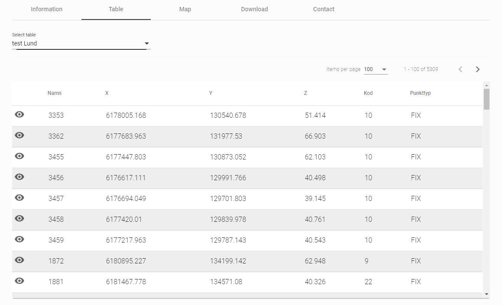

> De databronpagina in CKAN kan een of meer visualisaties van de brondata bevatten (een tabel, een staafdiagram, een kaart, enz.). Dit worden bronweergaven genoemd. 

## Preview in CKAN

Verschillende plug-ins zijn opgenomen in CKAN Dataplatform om een voorbeeld van verschillende bronbestandstypen te bekijken: 

* Data explorer 

    De Data explorer bestaat uit een ***raster-***,***grafiek-*** en ***kaartweergave***
    
    * Rasterweergave: geeft een tabel weer voor tabeldata (bijv. CSV/XLS/XLSX)
    * Grafiek: verschillende opties om een grafiek weer te geven voor onder meer CSV/Excel-bestanden
    * Kaartweergave: toont een kaart voor CSV-, Excel- of GeoJSON-bestanden die geografische coördinaten bevatten. 

    ***Opmerking:*** Deze plug-in vereist data in de [DataStore](datasets_AddingDatasources#datastore)

* Tekstweergave 
    * Kan tekstbestanden, zoals JSON- of XML-bestanden weergeven (kan afhankelijk zijn van de configuratie van de plug-in)

* Afbeeldingsweergave
    * Is geconfigureerd om PNG-, JPEG- of GIF-bestanden weer te geven

Meer informatie over het bekijken van databronnen is te vinden in <a href="https://docs.ckan.org/en/2.8/maintaining/data-viewer.html" target="_blank">CKAN documentatie</a>

### FAQ

#### V: Waarom is er geen weergave, hoewel een weergave volgens de documentatie beschikbaar moet zijn?

**A:** Voor tabeldata (bijvoorbeeld csv-/xls-bestanden) wordt de tabelweergave automatisch toegevoegd wanneer deze bestanden worden geüpload naar de DataStore, wat een vereiste is voor het laden van een Data explorer-weergave. Dit zou altijd moeten werken als een CSV/Excel-bestand wordt geüpload via de normale CKAN-gebruikersinterface. Als dit echter via een API-call gebeurt, kan het zijn dat sommige parameters ontbreken (het bestandstype is bijvoorbeeld niet opgegeven), waardoor de tabelweergave niet kan worden gemaakt. Als dit het geval is, volg dan de onderstaande stappen om een weergave te maken.

#### Q: Hoe kan ik een weergave toevoegen?
**A:** Je kunt een weergave toevoegen door naar: ***Beheer***->***Overzichten***->***Niuew overzicht***-> ***Data Explorer*** te gaan.

---

## Preview portaal

Op het portaal is er een ***tabelweergave*** en een ***kaartweergave***: 

#### Tabelweergave

Op het open data portaal wordt automatisch een tabel getoond voor bestanden die in de DataStore zijn opgenomen.

#### Kaartweergave

Wordt weergegeven wanneer de data in GeoServer staat.

