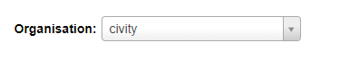
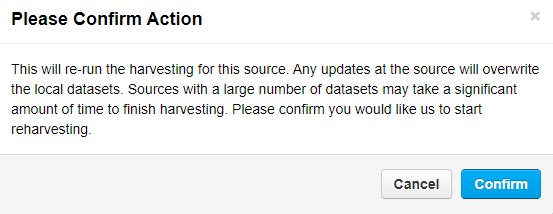
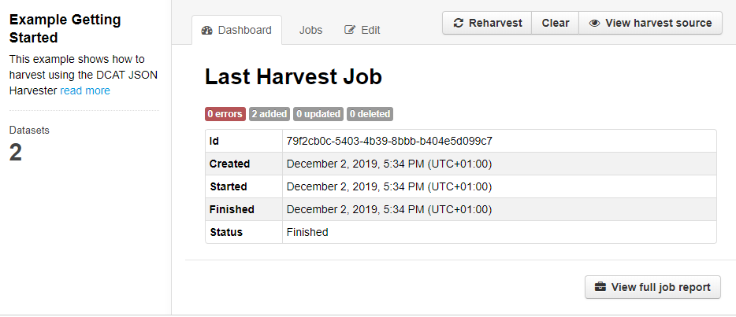

:::note Opmerking

Deze handleiding gaat uit van een gebruiker met adminrechten en een achtergrondkennis van welk type bronnen compatibel zijn met de drie harvester-opties in CKAN.

:::

Deze stapsgewijze handleiding laat je zien hoe je de drie typen harvesters configureert [harvester opties beschikbaar in CKAN](harvesting_Harvesting#types-of-harvesters). 

We demonsteren de configuratie van een JSON DCAT harvester. Na configuratie van deze harvester kun je data naar je eigen CKAN-instantie harvesten op basis van JSON objecten bestaande uit DCAT metadatavelden. 

Een aantal voorbeelden van JSON DCAT bronnen:

* https://raw.githubusercontent.com/ckan/ckanext-dcat/master/examples/dataset.json
* https://geoportaal-ddh.opendata.arcgis.com/data.json
* https://metadata.geodata-utrecht.nl/dcat

## Voorbeeld: Waar beginnen we mee?

Om te beginnen met het instellen van een harvester in CKAN, moet je `/harvest` toevoegen aan de URL van je CKAN-instantie. 

##### Voorbeeld: 
```sh
 https://JOUW-CKAN-INSTANTIE/harvest
```

On this `/harvest` page, you will see an overview of harvester sources that are currently set up. On this page you can add additional harvesters.

### 1. Een harvester toevoegen
Op deze `/harvest`-pagina zie je een overzicht van de harvesterbronnen die momenteel zijn ingesteld. Op deze pagina kun je extra harversters toevoegen..


### 2. Configureer een harvesterbron

Na het klikken op de *Add Harvest Source* knop, moet je de volgende velden invullen:

* ##### URL (verplicht)

    De URL bevat de daadwerkelijke harvesterbron. In ons voorbeeld gebruiken we een JSON-bestand wat bestaat uit DCAT metadata van twee datasets. Elke dataset inons voorbeeld bestaat uit meerdere verschillende bestandstypen. Een voorbeeld van een JSON-bestand dat kan worden gebruikt kan je [hier](assets/Dataplatform/Harvesting/Example_file.json) zien.

    


* ##### Titel (verplicht)

    De titel die wordt ingevuld wordt gebruikt in de URL van de naam van de harvester.
    


* ##### Beschrijving

    Voer een geschikte beschrijving in van je harvester
    


* ##### Selecteer het brontype

    In ons voorbeeld is het brontype de DCAT JSON Harvester. Een uitleg van de verschillende brontypes kan hier gevonden worden: [verschillende harvestertypes in CKAN](harvesting_Harvesting#types-of-harvesters).
    


* ##### Updatefrequentie
    > Als de frequentie is ingesteld op **altijd**, zal de harvester zo vaak mogelijk opnieuw harvesten. Met andere woorden, deze optie laat de harvester draaien met een zo klein mogelijk tijdsinterval.

    Opties voor updatefrequentie zijn: *altijd, wekelijks, tweewekelijks,* or *maandelijks*.
    


* ##### Custom configuratie
    >Custom configuratie kan alleen met JSON-objecten. Een voorbeeld van customer configuratie van de harvester vind je [hier](assets/Dataplatform/Harvesting/Example2.json).

    Met een custom configuratie kun je aanvullende vereisten of velden opgeven voor de harvester
    


* ##### Selecteer de juiste organisatie in het dropdownmenu

    

* ##### Sla je configuratie op 

    Klik op de blauwe `opslaan` knop - je harvester setup is nu afgerond.
    


### 3. De harvester starten

1. ##### Klik op de `Admin` knop 

    

2. ##### Klik op de `Reharvest` knop om de harvester te initialiseren

    

3. ##### Klik op de `Confirm` knop om het harvestproces te starten

    

### 4. Het harvesten
> Afhankelijk van de bron kan het harvesten één tot meerdere minuten duren om af te ronden.

Op de adminpagina van de harvester zie je een tabblad met het label *Dashboard*. Op dit tabblad zie je informatie over het huidige of laatst voltooide iteratie van de harvester.


In ons voorbeeld zie je dat er geen meldingen zijn onder **Last Harvest Job**. Als het proces is voltooid, kun je nogmaals op het tabblad *Dashboard* klikken om de pagina te vernieuwen.



Hier kunnen we zien dat het proces is voltooid - In ons voorbeeld laat de pagina zien dat er twee datasets zijn toegevoegd.

### 5. Bekijk datasets die zijn geharvest

* Klik op de **View Harvesting Source** knop om datasets te tonen die zijn toegevoegd gedurende het harvesten.
    

* De geharveste datasets worden nu getoond.
    