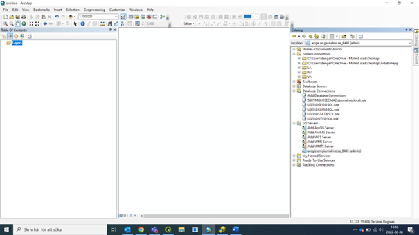

## WMS toevoegen in ArcMap

Open _Catalog_: (of ga naar de applicatie _ArcCatalog_):

---

Klik op ”Add WMS Server” en voer de link naar de server in:

---

Optioneel: Klik op “Get Layers” om te controleren of de link werkt en of ArcMap de server kan bereiken:

---

Eenmaal toegevoegd aan de serverlijst, kun je lagen toevoegen aan de kaart:

---

## Voeg WMS toe aan ArcGIS Online (en ArcGIS Portal/Enterprise)

Ga naar jouw kaart of creeër een nieuwe kaart:

---

Klik “Add” en kies “Add layer from web”:

---

Kies “A WMS OGC Web Service”, voer de link in en klik “Add layer”:

---
