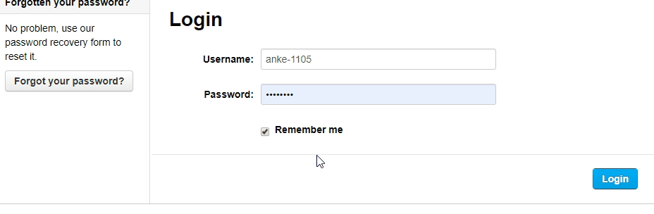

Om datasets toe te voegen, te bewerken of te verwijderen, moet je ingelogd zijn. Je loginrechten zijn ingesteld op organisatieniveau; Je hebt de mogelijkheid om lid te worden van één of meerdere organisaties. Hiermee kun je meerdere datasets in verschillende organisaties beheren. Elke organisatie bevat ook verschillende gebruikersrechten-niveaus; Rollen. 

Zie [Gebruikersrollen](user_UserRoles) voor meer informatie over gebruikersrechten.

## Inloggen
> Je gebruikersnaam vind je in je e-mail. Het volgt het formaat: `[gebruiker]-[number]`

Toegang tot een organisatie en rechten binnen een organisatie worden verleend door de organisatie-admin door middel van een uitnodiging; Zodra toegang is verleend, moet je je e-mail bevestigen; wanneer je je e-mailadres bevestigt, wordt een wachtwoord gegenereerd. 

De inlogknop bevindt zich bovenaan de pagina aan de rechterkant. Hier logt je in met uw gebruikersnaam en wachtwoord. 

<!--  -->

<!--  -->

## Dashboard
Wanneer je bent ingelogd verschijnt je naam bovenaan de pagina; je wordt naar het dashboard geleid. Met het dashboard kun je de nieuwste datasets bekijken waaraan je eerder hebt gewerkt.

Als je op "Mijn organisatie" klikt, kun je de datasets bekijken die eigendom zijn van jouw organisatie(s). Als je over de juiste rechten beschikt, kun je vervolgens datasets toevoegen, bewerken of verwijderen.

