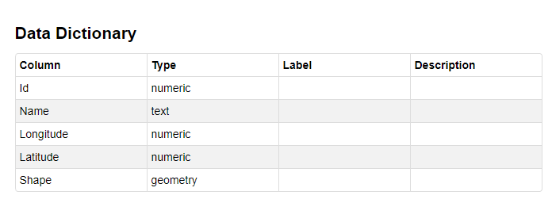

> Het Data woordenboek is een extensie van de DataStore (https://docs.ckan.org/en/2.9/maintaining/datastore.html#data-dictionary). Het Data woordenboek is een tabel met kolomnamen, type, begrippen en beschrijvingen.

## Wat kan ik doen met het Data woordenboek?

Het Data woordenboek kan worden gebruikt om de inhoud van een dataset explicieter te beschrijven aan de hand van labels en beschrijvingen.

Met het Data woordenboek kun je de volgende waarden voor elke kolom invoeren:

- Type Override: het type dat moet worden gebruikt de volgende keer dat DataPusher wordt uitgevoerd om data in deze kolom te laden
- Label: een mensvriendelijk label voor deze column
- Beschrijving: een volledige beschrijving voor deze kolom in markdown-formaat

:::caution Limitaties huidige UI omgeving:

- Via de UI is het voorlopig nog niet mogelijk om het type kolom te wijzigen.
- Wanneer je via beheer in de UI een resource wijzigt, betekent dit dat de volledige resource wordt overschreven met het nieuwe bestand. Gevolg is dat ook het Data woordenboek opnieuw wordt gegenereerd. Alle beschrijvingen en begrippen van de vorige resource worden hiermee dus ook gewist. Wanneer er bestanden regelmatig ververst/geüpdatet worden en men gebruik wil maken van de Data woordenboek functionaliteit zal men dus deze waardes via de API mee moeten geven.

:::

#### Tabel met Data woordenboek in CKAN:



## Heeft elke databron een Data woordenboek?

Nee, het Data woordenboek is alleen beschikbaar voor bestandsformaten die naar de DataStore kunnen worden doorgezet. De volgende bestandsformaten worden ondersteund:

- CSV
- DGN
- GeoJSON
- GPKG
- Shapefile/ZIP
- XLS, XLSX

Als de databron correct is geüpload naar de [DataStore](datasets_AddingDatasources#datastore), wordt de tabel datawoordenboek toegevoegd.

## Waar kan ik het Data woordenboek vinden?

Het data woordenboek kan zowel in **CKAN** als op het **open data portaal** worden bekeken.

#### CKAN:

Klik op een dataset -> klik op een databron

#### Portal

Klik op een dataset -> Klik op het tabblad _Tabel_ -> Klik op _Data woordenboek_

## Het Data woordenboek bewerken

> Het Data woordenboek kan worden bewerkt via de User Interface maar ook via de API

### Via de User Interface

#### 1. Klik in een dataset op de knop _‘Ontdek’_ van de databron die je wilt bewerken en klik vervolgens op _‘Bijwerken’_.


#### 2. Ga naar het tabblad _Data woordenboek_


#### 3. Bewerk type / label / beschrijving


#### 4. Klik ten slotte op de knop ‘Bewaar’ hieronder


#### Wijzigingen zoals weergegeven in de Portal:


### Via de API

Door onder het “info” veld de gewenste informatie mee te geven:

```sh
{
    "id":  # the column name (required)
    "type":  # the data type for the column
    "info": {
        "label":  # human-readable label for column
        "notes":  # markdown description of column
        "type_override":  # type for datapusher to use when importing data
        ...:  # other user-defined fields
    }
}
```
