Het Open Data Portaal biedt een omgeving waar je je doelen, showcases en verhalen kunt benadrukken. Er is een aparte pagina waarop alle datasets worden weergegeven. Via de filter- en zoekopties kunnen gebruikers eenvoudig naar een dataset navigeren. De datasets kunnen ook worden gerangschikt volgens de thema's of organisaties / afdelingen.

De datasets worden altijd getoond met de metadata en een downloadoptie. Daarnaast kan er een contactformulier worden toegevoegd. Indien van toepassing wordt ook een tabel, kaart of API verstrekt.

## Welkomstpagina

De welkomstpagina van het open data portaal bevat inleidende beschrijving van wat op het portaal te vinden is. Daarnaast bevat deze pagina vaak meer uitleg over welke organisaties er op het portaal data publiceren en kunnen er algemene voorwaarden beschreven zijn. Daarnaast zijn er contactgegevens te vinden van de beherende organisatie.

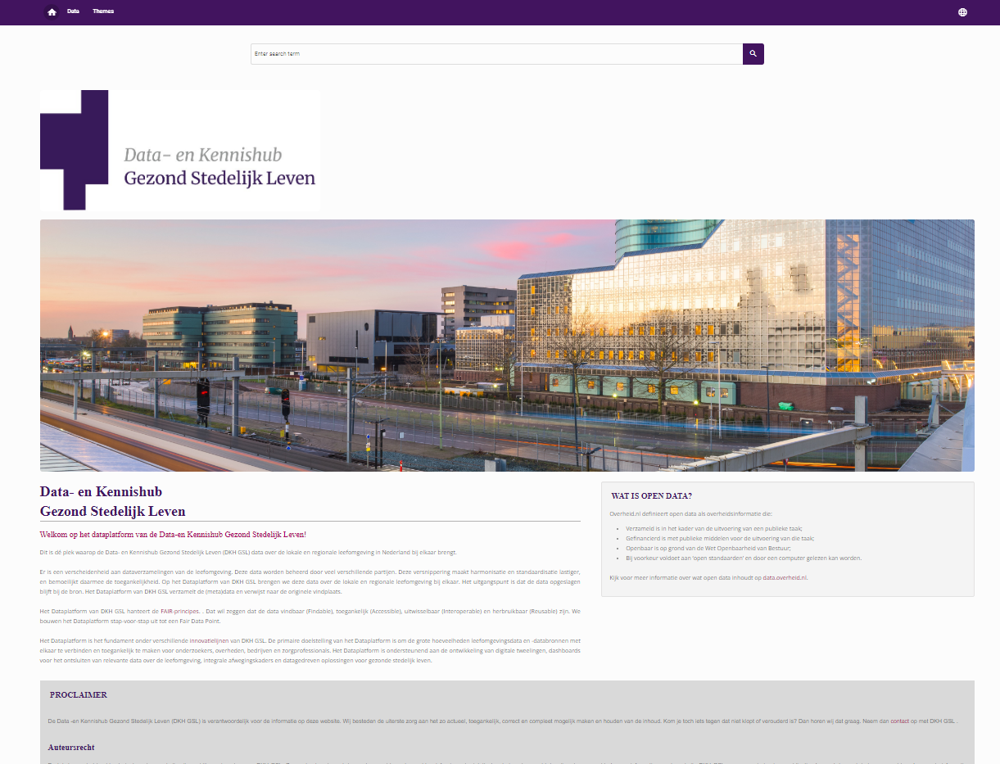

###

## Zoeken

De zoekbalk biedt automatische aanvulling. Begin met typen om suggesties te krijgen, op basis van de titel, beschrijving of tags.

## Overzicht datasets

Wanneer je op 'Data' klikt krijg je een overzicht van alle beschikbare datasets. Elke dataset bevat een overzicht van de beschikbare weergaveopties. Op de overzichtspagina kunt je de zoekresultaten verder verfijnen door het 'Filters' menu te gebruiken.

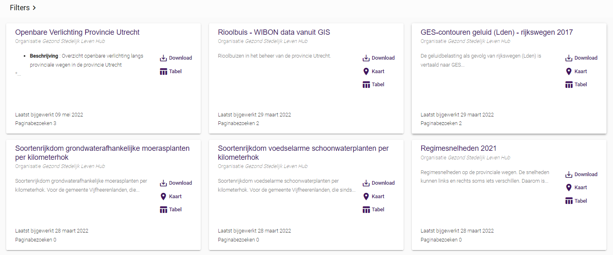

## Filters

:::info Let op!

Specifieke filteropties kunnen per portaal verschillen.

:::

De filteropties bieden verschillende manieren om naar bepaalde datasets te zoeken. Actieve filters worden weergegeven. Met de optie "Verwijder" worden alle filters verwijderd. Het is ook mogelijk om afzonderlijke filters te wissen, door middel van het kruisje achter een filter.

<table class="table-imageStyles">
    <tbody>
        <tr>
            <td>
                
            </td>
        </tr>
    </tbody>
</table>

## Dataset tabbladen

De volgende tabs zijn beschikbaar wanneer je een specifieke dataset selecteert:

1. Informatie: bevat een beschrijving, tags, metadata en statistieken over de dataset.
2. Tabelweergave: toont een preview van een geselcteerde databron.
3. Kaartweergave: toont een preview van de data op de kaart.
4. Download: downloaden van beschikbare databronnen.
5. Contactformulier: stellen van vragen op datasetniveau.

Hieronder vind je een uitgebreidere beschrijving van de verschillende tabbladen:

### 1. Informatie

Als je op informatie klikt, zijn de volgende categorieën informatie beschikbaar:

- Beschrijving
- Tags
- Metadata
- Statistieken

**Beschrijving**: Hier vind je een omschrijving van de dataset in het algemeen en mogelijk ook over de databronnen die onderdeel zijn van de dataset. Hoe uitgebreid deze beschrijving is, zal per dataset verschillen.

**Tags**: Tags, ook wel labels of trefwoorden genoemd, zijn een manier om een dataset te classificeren. Via tags kunnen vergelijkbare datasets worden gevonden. Wanneer je op een tag klikt kom je op een overzichtspagina van datasets waar deze tag ook is gebruikt.

**Metadata**: Als je op metadata klikt, zie je een overzicht van alle metadatavelden die bij de dataset horen. Het merendeel van de metadatavelden is afkomstig uit de DCAT standaard. Hierdoor kunnen open datasets, automatisch worden weergegeven in de nationale dataregisters en het EU-portaal. Daarnaast is er voor geografische datasets een aantal specifieke metadatavelden aanwezig om de data door te kunnen zetten naar Geonetwork (Nationaal Georegister).

**Statistieken**: Hier vind je de laatst bijgewerkt datum, het aantal paginabezoeken en de waardering van de dataset.

:::caution Let op!

Een paginabezoek wordt geteld wanneer een dataset via de CKAN-url wordt bekeken. Het bekijken van de data via het portaal wordt dus niet automatisch als paginabezoek geteld.

:::

### 2. Tabel

Voor databronnen die in de DataStore zijn opgeslagen is de tabelfunctionaliteit beschikbaar. De tabel toont een preview van de data per databron. Als je op het 'oog'-pictogram drukt, kun je via een pop-up in één oogopslag een overzicht zien van de kolomnamen en waarden voor een specifieke rij.

#### Datastore-tabel downloaden

Onder de tabel vind je de optie om de DataStore-tabel te downloaden. Met de DataStore-tabel download kun je per databron de DataStore-tabel, zoals getoond bij de preview, downloaden.

:::caution Let op!

De DataStore-tabel download kan verschillen van de download via het 'Download' tabblad. Het 'Download' tabblad bevat altijd het orignele databestand. Wanneer het databestand wordt doorgezet naar de DataStore is het mogelijk dat er extra kolommen aan het databestand zijn toegevoegd, bijvoorbeeld om de tabel- of kaartweergave te verbeteren.

:::

#### Data woordenboek

Het Data woordenboek kan worden gebruikt om de inhoud van een dataset explicieter te beschrijven aan de hand van labels en beschrijvingen. Soms zijn bijvoorbeeld de kolomnamen die in een databron voorkomen niet erg duidelijk voor een eindgebruiker. Klik [hier](./dataplatform_DATASETS_DataDictionary.md) voor meer informatie over het Data woordenboek.

#### Metadata

Hier vind je de metadata die hoort bij de geselecteerde _databron_.

### 3. Kaart

Via het tabblad 'Kaart' kun je een preview vinden van geografische data. Via onderstaande screenshots wordt de beschikbare functionaliteit verder toegelicht:

#### Welkomstpagina:

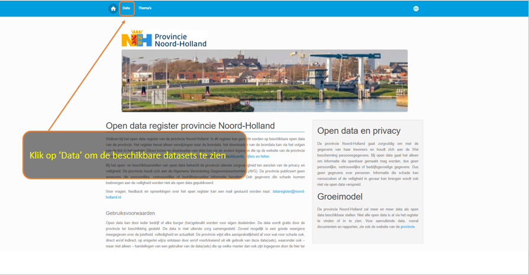

#### Data tabblad:

#### Kaart tabblad:

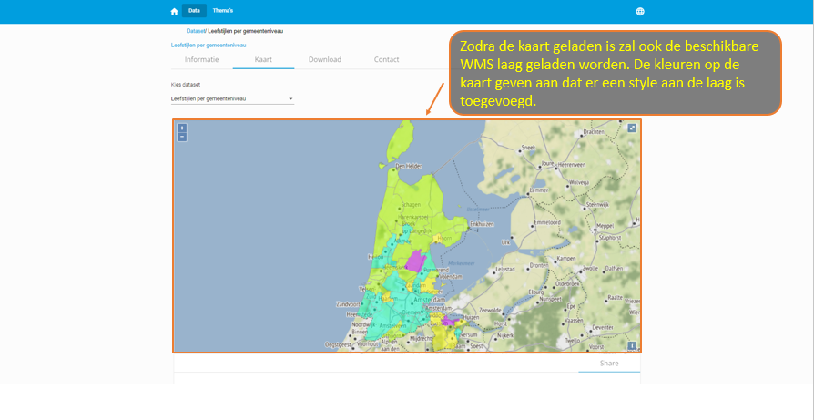

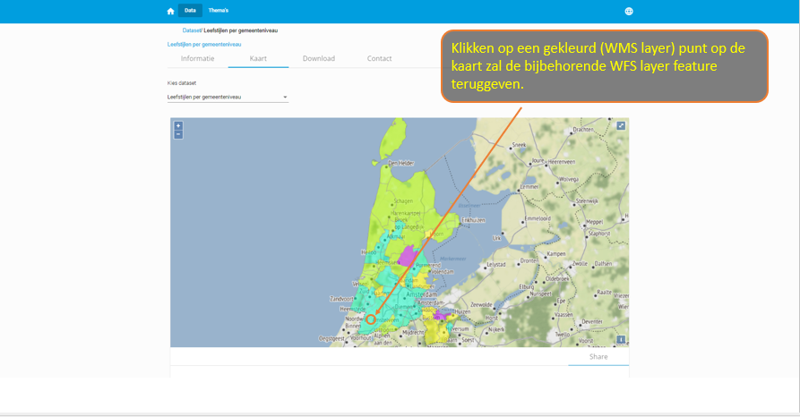
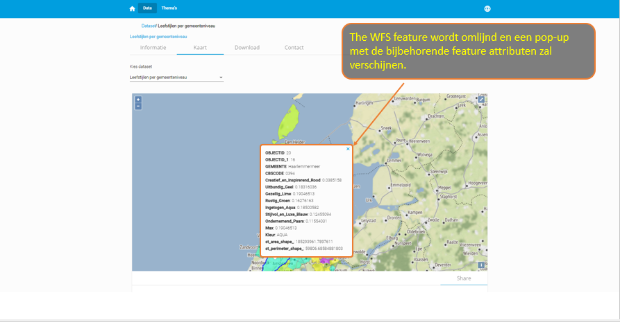

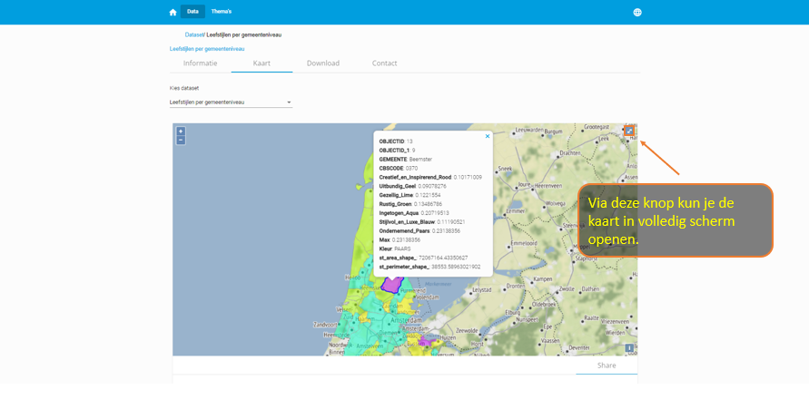

#### Time series data

##### Kaart met meerdere lagen: algemene functies

1. Bij implementatie met meerdere lagen krijgt de gebruiker bij het openen van het tabblad Kaart niet langer een dropdownmenu om te selecteren om één bron tegelijk weer te geven, maar in plaats daarvan worden alle lagen tegelijkertijd geladen en weergegeven.

2. Linksboven op de kaart is een nieuwe legendaknop toegevoegd onder de zoomknoppen. Door op deze knop te klikken, onthult de gebruiker een lijst met beschikbare geodata-lagen. Standaard zijn alle lagen zichtbaar bij het openen van het tabblad Kaart.

3. Wanneer u op de kaart klikt, wordt een pop-up weergegeven met informatie over de geselecteerde features. Als er overlappende lagen zijn, wordt de pop-up gevuld met meer dan één tabblad, elk met de bijbehorende laag.

4. De gebruiker kan op elk moment kiezen welke lagen worden weergegeven. Door op de checkbox naast de naam van de laag te klikken (in het legendavak), kan de gebruiker een laag in- of uitschakelen.

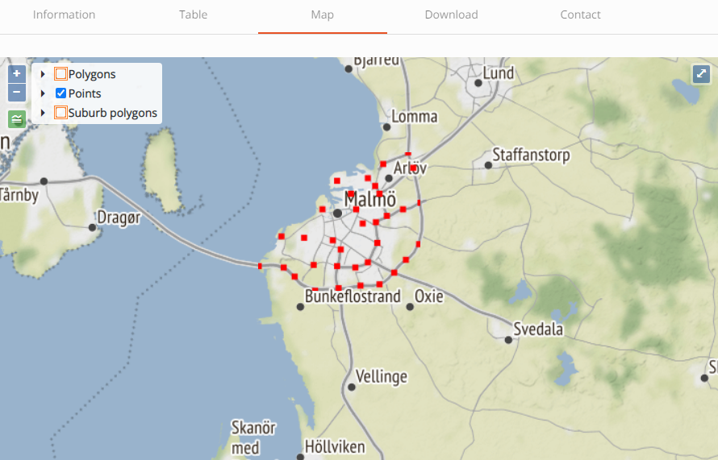

5. Op deze manier kan de gebruiker alleen informatie opvragen voor de laag van zijn keuze, in het geval van overlappende lagen.

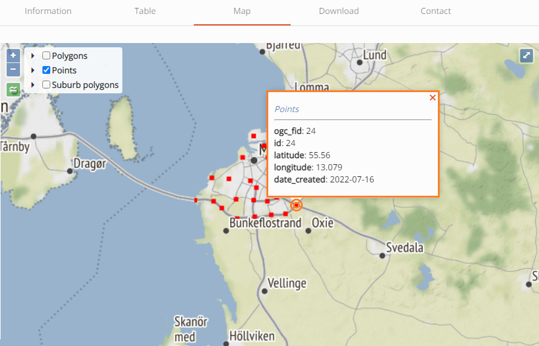

6. De gebruiker kan ook gebruikmaken van de functionaliteit op volledig scherm, waarbij de kaart en zijn lagen in een hogere resolutie worden weergegeven. Als u op de knop Volledig scherm in de rechterbovenhoek van de kaart klikt, wordt de kaart in volledig scherm uitgevouwen.

##### Kaart met meerdere lagen: functie voor datumkiezer

1. Wanneer ten minste één van de lagen een _time series_-kolom heeft, wordt een TimeSeries-knop weergegeven in de rechterbovenhoek van de kaart, naast de knop voor volledig scherm.

2. Het veld 'Time series kolom' wordt ingesteld als een metadataveld van een bijlage in CKAN, waar de gebruiker de kolom definieert waar datums in voor komen en zal worden gebruikt om de resultaten op basis hiervan te filteren.

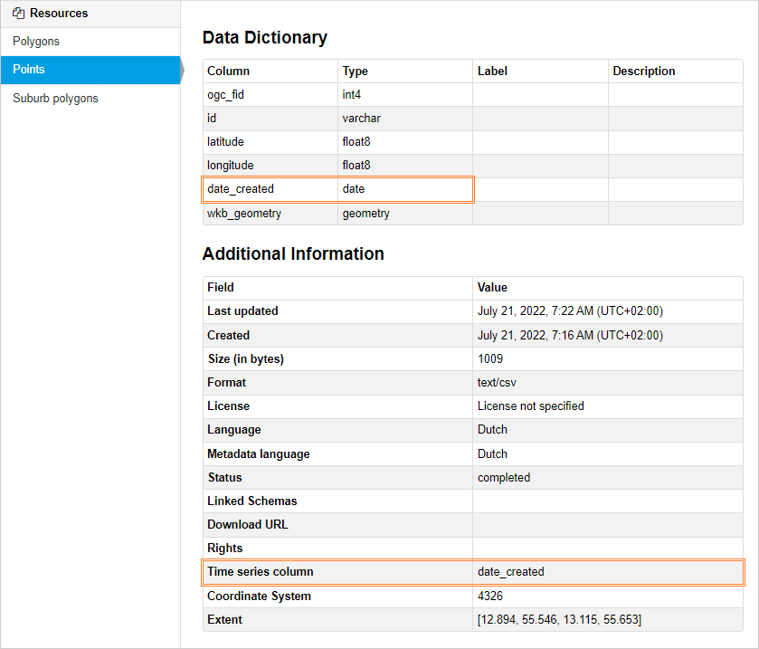

3. Wanneer u op de legenda-knop in de linkerbovenhoek klikt om de lijst met beschikbare lagen weer te geven, kunnen de lagen die een 'Time series kolom' bevatten, worden herkend aan een vergelijkbaar datumpictogram naast hun naam.

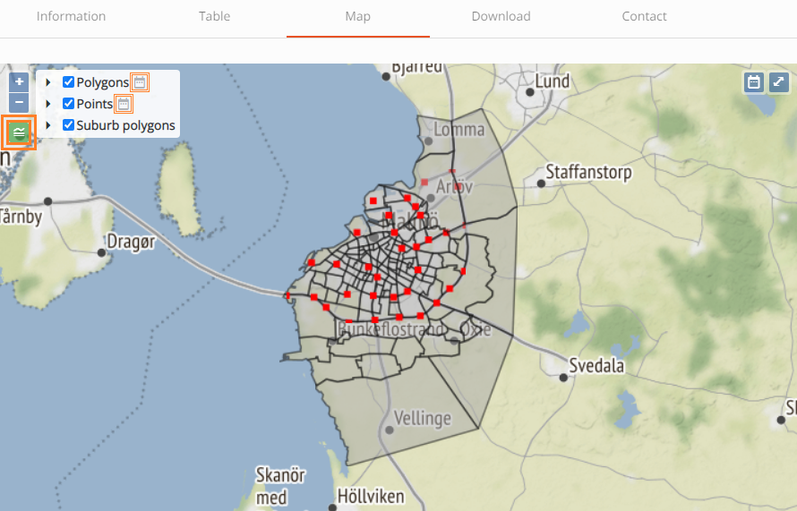

De gebruiker kan het filter Datumkiezer inschakelen door op de knop Datumkiezer te klikken. Er verschijnt een datummenu met opties voor datumselectie.

Hiermee worden gegevens automatisch gefilterd op basis van het standaard datuminterval (1 dag). De standaarddatum bij het inschakelen van Datumkiezer is ingesteld op de datum van vandaag.

Andere bijlagen zonder ingevulde 'Time series kolom' zullen altijd al hun beschikbare gegevens weergeven, ongeacht het ingestelde datumbereik. Als de gebruiker in de war is door de hoeveelheid weergegeven gegevens, kan hij eenvoudig de onnodige lagen verbergen door ze uit de lijst met legendalagen te deselecteren.

Als de gebruiker een ander interval wil instellen, heeft hij twee opties:

1. Selecteer een andere startdatum en de einddatum wordt automatisch aangepast op basis van het standaardinterval (1 dag)

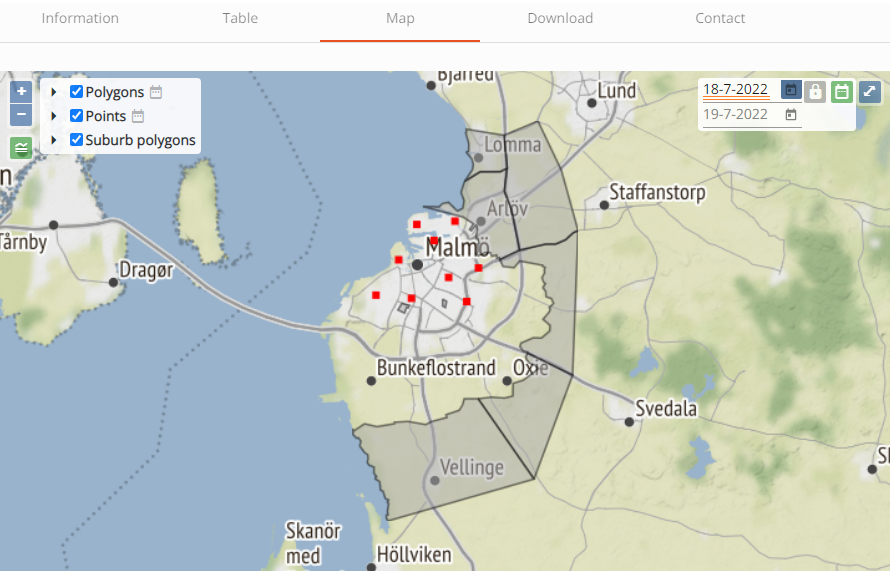

2. Ontgrendel het interval, selecteer zowel een startdatum als een einddatum en klik vervolgens op de Refresh-knop die wordt onthuld.

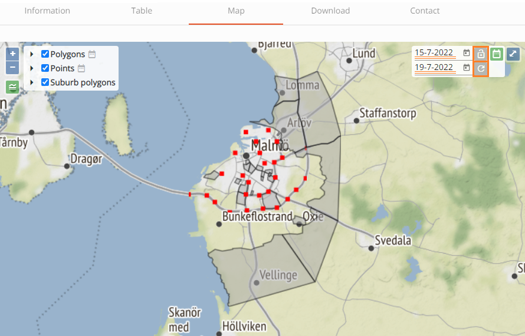

De gebruiker kan nog steeds een laag verbergen terwijl het filter Datumkiezer is ingeschakeld.

Wanneer je het interval opnieuw vergrendelt naar 1 dag, dan blijft de startdatum intact en wordt de einddatum automatisch ingesteld om overeen te komen met de intervalregel van 1 dag.

De gebruiker kan het filter Datumkiezer uitschakelen door nogmaals op de overeenkomstige knop te klikken. Het datummenu verdwijnt.

Hierdoor wordt het filter uitgeschakeld en wordt de kaart vernieuwd om de volledige gegevens van de timestamp-laag weer te geven. Lagen zonder timestamp blijven zoals ze zijn.

#### Tekentool: Downloaden van data binnen een bepaald geografisch gebied

Een tekenknop bevindt zich op het scherm rechtsboven in de kaart, naast de 'full-size'-knop.

---

Door de Draw Control te activeren, wordt een menu met opties getoond, waar de gebruiker kan kiezen tussen 3 verschillende vormen: een rechthoek, een cirkel of een vrije polygoon.

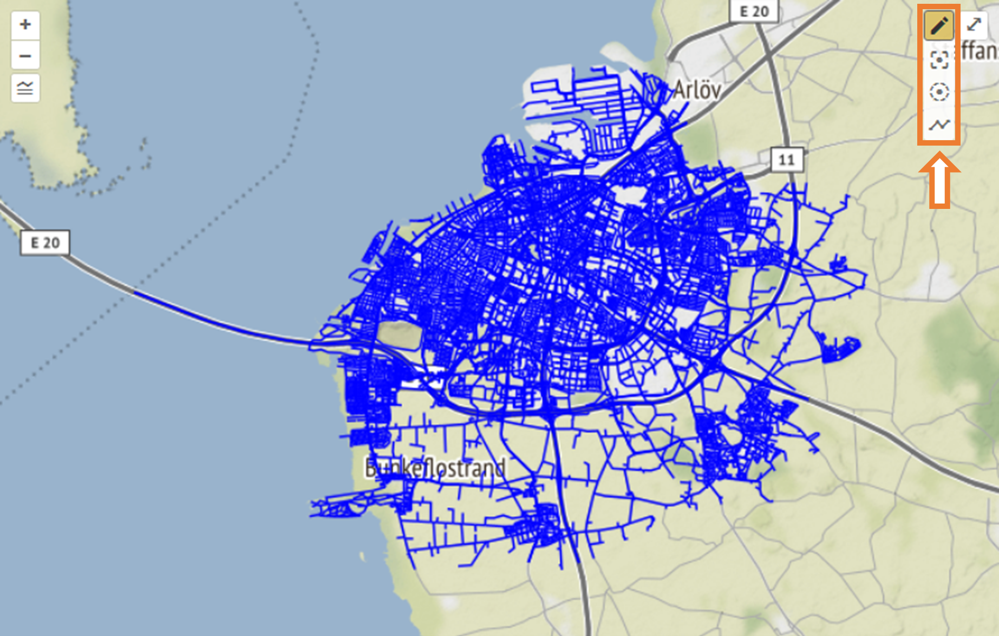

---

Voorbeeld van het tekenen van een rechthoekig selectiekader:

---

Voorbeeld van het tekenen van een cirkelvormig selectiekader:

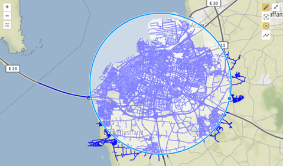

---

Voorbeeld van het tekenen van een vrije polygoon:

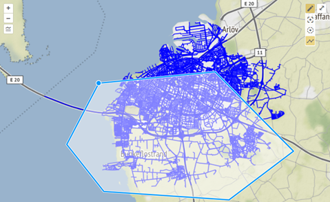

---

Na het tekenen van het selectiekader, heeft de gebruiker de mogelijkheid om de data binnen het selectiekader te downloaden.

In plaats van de normale inhoud van het dropdownmenu, zoals hieronder weergegeven..:

.. wordt er nu een nieuw blauw symbool getoond voor elke downloadoptie. Dit geeft aan dat het type bestand wat gedownload wordt alleen de data bevat binnen het geselecteerde geografisch gebied:

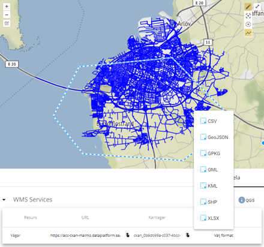

---

Wanneer de gebruiker een bestandstype selecteert om te downloaden, zal het dropdownmenu tijdelijk onbeschikbaar zijn. Dit wordt aangegeven met een 'spinning wheel'. Zodra de download voltooid is zal het 'spinning wheel' weer verdwijnen en zal het menu weer beschikbaar zijn:

x

---

Hetzelfde geldt voor het 'Download' tabblad. Het enige verschil tussen de twee tabbladen is dat in het 'Download' tabblad de gebruiker geen data kan downloaden zolang er een geografisch filter actief is:

---

Als de download niet kan worden voltooid, zal er een foutmelding worden getoond. Dit kan worden veroorzaakt door een downtime van de server of een verzoek dat te lang duurt en dus een time-out geeft (grote hoeveelheden data). Als de fout zich blijft voordoen, wordt de gebruiker geadviseerd contact op te nemen met Civity support:

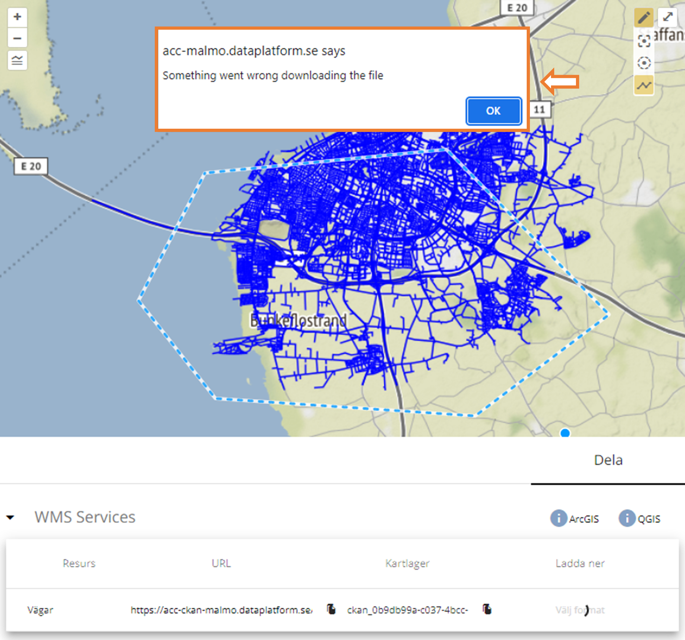

---

### 4. Downloaden

Hier kun je de originele databronnen downloaden in de beschikbare formaten. Daarnaast is er onder het kopje API een uitleg te vinden hoe je via de DataStore API de data kunt doorzoeken.

#### Downloaden van data

Er zijn verschillende manieren om een dataset te downloaden.

1.  Als je op het tabblad 'Data' klikt, zie je alle beschikbare datasets. Ze worden elk weergegeven in een zogenaamde _card_. Aan de rechterkant van de card zie je een 'download'-knop. Door erop te klikken kom je op de pagina met alle downloadbare bestanden en een overzicht met endpoints. Door op de cloud achter het bestand te klikken, kun je het bestand downloaden.

2.  Als je op een dataset hebt geklikt om erachter te komen of het de juiste dataset is, kun je naar het downloadtabblad gaan. Daar vind je alle bestanden om te downloaden.

### 5. Contactformulier

Bij sommige portalen is er een contactformulier aanwezig bij een dataset. Hier vind je een formulier waar je vragen over de dataset kunt achterlaten. Deze vragen komen bij de organisatie achter het open data portaal terecht.

## Thema's

Het Thema's tabblad toont een overzicht van datasets binnen een bepaald thema. De thema's zijn afkomstig uit de [DCAT standaard waardelijst](https://waardelijsten.dcat-ap-donl.nl/overheid_taxonomiebeleidsagenda.json). Het klikken op een thema fungeert als een filter, om de relevante datasets te tonen. Het aantal dat bij elk thema wordt weergegeven, verwijst naar het aantal datasets.

## Taal selectie

Door op de wereldbol rechtsbovenin te klikken, kun je van taal wisselen. Daarnaast kun je daar de huidige versie van het open data portaal terugvinden.

:::note Let op!

De welkomstpagina-teksten en teksten behorende bij een specifieke dataset zullen niet worden aangepast naar de geselecteerde taal.

:::
