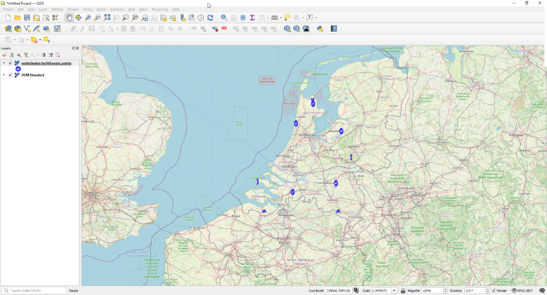

Om een WMS laag toe te voegen aan QGIS, moet een connectie met de WFS worden gedefinieerd. 
Ga naar `Layer/Add layer` en selecteer `Add WMS/WMTS layer`.

 
Klik op `New` om een WMS connectie te definiëren.

---

 
 Vul de naam in, de URL kan gekopieerd worden van Dataplatform en klik op `OK`. Klik daarna op `Connect` en selecteer de laag van de beschikbare lijst met lagen die verschijnt. De naam kan ook in Dataplatform gevonden worden.

--- 

 
En klik op `Add` om een laag toe te voegen aan de kaart.

---

