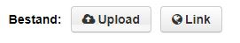

> Alle databronnen/bijlages zijn onderdeel van een dataset.

Databronnen kunnen alleen aan datasets worden toegevoegd nadat de (verplichte) metadata van een dataset is ingevuld.

## Handmatig uploaden

### Databronnen toevoegen

Nadat de metadata op datasetniveau is beschreven, kan data worden toegevoegd. Klik op de knop 'Volgende: Data toevoegen'.

Op deze pagina kunnen één of meerdere bestanden ("resources") aan de dataset worden toegevoegd. Er zijn twee manieren om een bestand toe te voegen:

- Door een bestand te uploaden
- Door te linken naar een bestand via een URL (locatie)

Als er een CSV, DGN, GeoJSON, GPKG, Shapefile/ZIP, XLS of XLSX wordt toegevoegd (zowel uploaden als linken), wordt het bestand opgeslagen in de DataStore van het DataPlatform en toegankelijk via de DataStore API. Andere bestandsformaten worden opgeslagen als een bestand en zijn beschikbaar om te downloaden.

Ook bij een databron moet verplichte metadata worden ingevuld:

1. Titel: geef een onderscheidende naam aan het bestand.
2. Omschrijving : leg de inhoud van het bestand uit.
3. Formaat – Het formaat waarin de bron wordt geleverd, bijvoorbeeld CSV, XLS, JSON, PDF enz. Dit veld kan leeg blijven. CKAN bepaalt het formaat zelf op basis van de extensie.

Als je meerdere databronnen (uploaden of links) aan de dataset wilt toevoegen, kies je "opslaan en nog een toevoegen". Als je slechts één bestand aan de dataset toevoegt, kies je 'voltooien'

CKAN slaat het bestand op en publiceert de dataset. Het resultaat wordt onmiddellijk weergegeven. Als de dataset openbaar toegankelijk is, kan het resultaat ook worden weergegeven op het Open Data Portaal. Datasets die privé zijn, zijn niet zichtbaar op het Open Data Portaal..

## Real-time / IoT data

> Real-time data kunnen als bron worden toegevoegd, maar de installatie en configuratie moeten door Civity worden afgehandeld.

Er moet een verbinding worden geconfigureerd tussen de API en DataPlatform. Fiware-componenten worden gebruikt om velden van de API te configureren, die vervolgens worden vertaald in nuttige open data.
